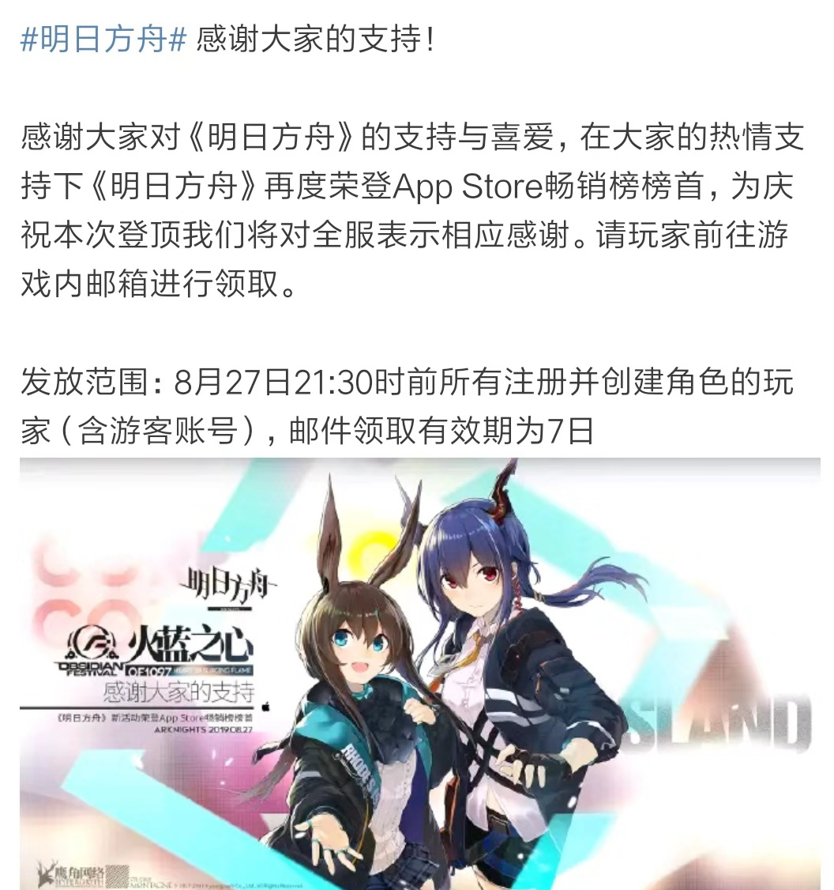
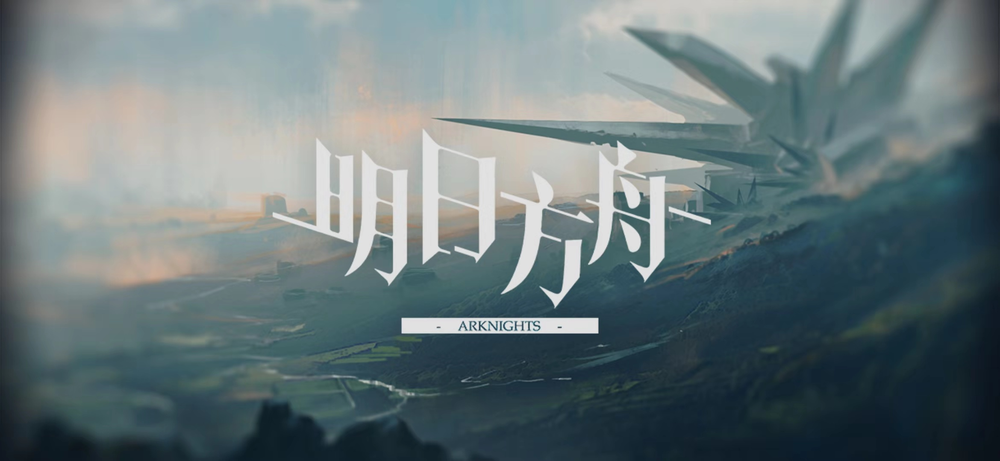
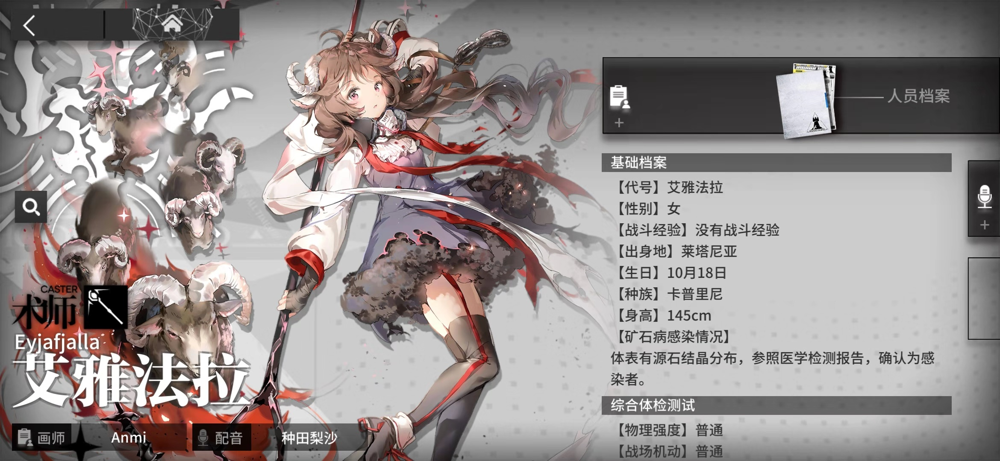
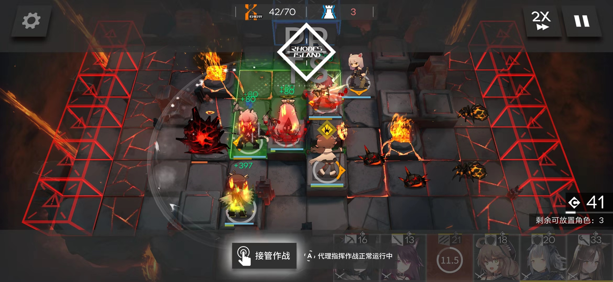
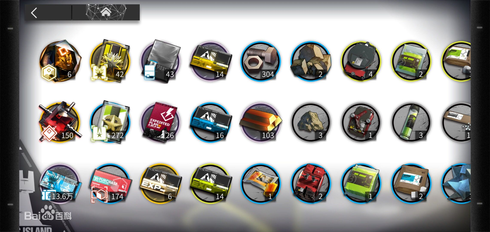

# 什么造就了《明日方舟》的成功？

本文总阅读量次

## 前言
开服4个月Tap Tap评分8.8，好评超过9成，多次在各手游排行榜上霸榜第一，《明日方舟》（下称“舟游”）无疑是今年截至目前最成功的新二次元手游。而最近，“舟游”抓住暑期的小尾巴上线的为期一个月左右的新活动“火蓝之心”，则又一次让其登顶App Store畅销榜，为此官方也向全体玩家发放了登顶福利以示庆祝。

而我作为“舟游”的玩家，同时最近也略微拜读了老师推荐的关于游戏设计的书——[Tracy Fullerton, GAME DESIGN WORKSHOP, 2e](https://www.baidu.com/s?ie=utf-8&bs=GAME+DESIGN+WORKSHOP&f=8&rsv_bp=1&rsv_spt=3&wd=GAME+DESIGN+WORKSHOP+pdf&rsv_sug3=5&rsv_sug1=5&rsv_sug4=300&inputT=4978)，所以在这篇博客我会从游戏设计元素方面简单分析一下“舟游”的成功因素（不过是从玩家角度得出来的一点浅显的见解）。

## 游戏设计元素
### 玩家（players）
在游戏中，玩家扮演的角色是罗德岛的领导者“博士”（刀客塔），带领罗德岛的一众干员救助受难人群、处理矿石争端以及对抗整合运动。在错综复杂的势力博弈之中，寻找治愈矿石病的方法。

玩家可以控制的游戏角色成为“干员”，被分为了：先锋、近卫、重装、狙击、特种、医疗、术师、辅助共计八个职业，通过“公开招募”以及“干员寻访”等方式获取。玩家利用招募到的干员，组建自己的队伍，去挑战游戏的关卡同时解锁游戏的剧情。

玩家的交互模式主要是玩家 vs 游戏系统，与其他玩家的交互非常少，例如能够“白嫖”（借用）其他玩家优秀的干员作为队伍中的支援。

###  目标（objectives）
“舟游”是一款魔物主题的策略手游，游戏模式是通过在一些位置摆放干员，消灭掉所有敌人，从而阻止敌人进入到一些区域，具有一定的挑战性。

实际上，这款游戏对于不同的玩家，所追求的目标也不一样。这也是这款游戏成功的原因之一，它在不同方面都吸引着玩家去玩这款游戏。最基本的目标，就是通关游戏，解锁游戏的剧情（就剧情都值得去玩）。然后为了通关游戏，玩家必须去强化自己的队伍，可以抽取星级更高的干员，也可以强化自己的干员（比如升级和精英化），第二次精英化自己的干员会解锁新的干员的皮肤，这也是游戏的目标之一。有的玩家也把游戏玩成了收集类游戏，因为每个干员都有自己的故事，性格，也有自己的声优和立绘等等，所以说就干员本身也吸引着玩家，玩家会为了自己喜欢的干员，不停的去抽卡（也就是干员寻访）。

###  游戏过程（procedure）
上面也介绍了这款游戏的的游戏模式，具体操作是将干员放到一些可以摆放的方块上，并选择该干员面向的方向以确定干员的攻击范围（每个干员都有自己的职业，每一类职业的干员分别负责相应的工作，同一职业类又因其攻击特点又分别负责不同的工作），同时每个干员也能释放自己的技能。最后把所有从红色门出来的敌人消灭，从而阻止敌人进入到蓝色门当中。除此之外，不同的关卡也会有许多不同的特色。

该游戏是一款策略手游，动动手指就能进行游戏，对手速要求不高，更多考验的是策略。

### 规则（rules）
游戏中当然也会有一些规则，比如某些干员只能放置在某些方块当中，还有放置干员也需要cost（cost是自然回复）等等。这些都是游戏的基本规则，还有一些关卡也会设定特有的规则以增加游戏的难度以及乐趣。

### 资源（resources）
资源主要分为以下几类，没提到的还有该游戏的货币：龙门币。每种资源都有自己的作用，根据作用大小也有相应的获取难度。同时，玩家也能用人民币充值以获取游戏中相应的资源。
|名称| 介绍 |获取途径|
|--|--|--|
|作战记录  | 分为基础、初级、中级、高级四个等级。该类道具能为干员提供升级所需要的经验。四个等级的作战记录所能提供的经验量依次递增。 | 日常任务/物资筹备-战术演习关卡|
|芯片  |按等级可分为芯片与芯片组，按照种类可以划分为八种，分别对应八种职业。该类道具是干员精英化的必要素材。其中芯片能够使干员达到精英1，而芯片组能够使干员达到精英2。  |芯片搜索关卡 |
|素材  | 素材的种类繁多，主要可分为源岩系、装置系、异铁系、酯系、糖系和碳系。从等级上划分为灰、绿、蓝、紫、橙五个等级，等级越高的素材越难获取。其中碳系素材仅能用于基建，其余素材可用于干员精英化和提升技能等级。 | 剧情关卡（碳系可在物资筹备-资源保障中获取）|
|寻访凭证  | 分为寻访凭证和十连寻访凭证两种。该类道具能为玩家提供获取新干员的机会。 | 采购中心|

### 冲突（conflict）
冲突主要体现在游戏关卡难度的不断提升，以及干员强化所需资源的增加，以及稀有资源的获取难度增加。游戏中也会给玩家的资源利用，生产建设等有多种选择，让玩家根据自己的情况选择对自己最有利的发展策略，以提高自己在游戏中的竞争力。

### 边界（boundaries）
游戏的边界还是挺明显的，该游戏的自由度并不是那么大，主要的游戏还是关卡以及如何提升自身竞争力等。

### 结果（outcome）
游戏的目标是不停通关，而剧情关卡也不断的设计中，所以游戏结果并不清晰。玩家可以升级自身等级为满级（100），或者说把自己的所有干员都升级到满级，或者说是收集完全部干员等等，这都是游戏的结果。“舟游”并没有对玩家的战斗力等进行计算，也没有对玩家进行排名，所以游戏的乐趣并不是与其他玩家进行对比，而在于游戏剧情故事的发掘以及对干员的养成。

## 什么吸引了玩家？
在[GAME DESIGN WORKSHOP](https://www.baidu.com/s?ie=utf-8&bs=GAME+DESIGN+WORKSHOP&f=8&rsv_bp=1&rsv_spt=3&wd=GAME+DESIGN+WORKSHOP+pdf&rsv_sug3=5&rsv_sug1=5&rsv_sug4=300&inputT=4978)当中提到吸引玩家的主要有个要素：挑战、玩法、谜题、前设、角色、故事以及戏剧元素。“舟游”在这些方面都有自己的特点，所以能够吸引大量玩家。

首先游戏的关卡有一定的难度，给玩家一定的挑战性。同时游戏的策略性的玩法，给予玩家多种解谜方法，谜就是如何成功通关，这是玩法上的吸引人。

然后是“舟游”的故事上的吸引人。包括本身游戏的前设，我理解为背景故事。虽然游戏的体量不大，但里面的世界格局还是较大的。同时“舟游”也注重游戏故事设计的细节，每个干员都是故事里的人物，都有自己的性格特点，专业等等，这些特征又表现在她在游戏关卡中攻击的特点（天赋以及技能等）。每个干员都是活灵活现的人物，干员之间也会有关联，当然故事之中的关联暂时还没有体现到通关中（如果可以，我希望干员之间的关联会使他们在游戏中产生特别的反应）。

当然，该游戏吸引我的绝仅不是任意一个特点，是其游戏故事的丰富性以及玩法的有趣性的结合。从任意一个方面来看，都有很多游戏要比“舟游”要来得优秀，但“舟游”将这两方面完美结合，玩法不复杂，又有丰富的故事作基础，非常适应当代的手游环境。更重要更重要的是，我能从这款游戏的很多方面看出来游戏商的用心。当游戏设计者与玩家产生了共鸣，这款游戏也就离成功不远了。

## 总结
这篇博客不是一篇技术博客，只是一篇吹水博客。不过是我看了[GAME DESIGN WORKSHOP](https://www.baidu.com/s?ie=utf-8&bs=GAME+DESIGN+WORKSHOP&f=8&rsv_bp=1&rsv_spt=3&wd=GAME+DESIGN+WORKSHOP+pdf&rsv_sug3=5&rsv_sug1=5&rsv_sug4=300&inputT=4978)这本书之后，对游戏设计方面进行的分析。未来在这门课的学习都是偏技术类的，所以本篇博客只是一个游戏编程学习的一个开端，让我感受到了游戏设计的魅力。我在这里选择的是一款较新的游戏，我被其吸引，所以能体现我对游戏最深刻的感受。