## 第一次作业

### 1、简答题

#### 解释 游戏对象（GameObjects） 和 资源（Assets）的区别与联系。
1. 游戏对象（GameObjects）
    官方文档：Every object in your game is a GameObject, from characters and collectible items to lights, cameras and special effects. However, a GameObject can’t do anything on its own; you need to give it properties before it can become a character, an environment, or a special effect.
       
    自我理解：游戏对象（GameObjects）就是Unity 场景中所有实体的基类，游戏中的每个对象都是一个游戏对象，包括可收藏的物品到灯光、相机还有特效等等。文档提到一个游戏对象不能自己做任何事情；你需要给它一些属性，才能使它成为一个角色、一个环境或一个特殊效果。

2. 资源（Assets）   
    官方文档：An Asset is a representation of any item you can use in your game or Project. An Asset may come from a file created outside of Unity, such as a 3D Model, an audio file, an image, or any of the other file types that Unity supports. There are also some Asset types that you can create in Unity, such as a ProBuilder Mesh, an Animator Controlle, an Audio Mixer, or a Render Texture.

    自我理解：就是一种可以在游戏项目中使用的资源，包括各种3d模型、音视频、图像等，同时我们也可以创建游戏对象（GameObjects）并组合起来，制作为预设（Prefabs），也是供使用的一种资源。总而言之，资源（Assets）就是一系列游戏编程中需要使用到的素材。
    
3. 区别与联系  
    区别：游戏对象是游戏中一个实体，是在游戏中充当某个角色的；而资源作为素材可供游戏对象使用，或者使用资源组成新的游戏对象。 

    联系： 上面的解释也提到，游戏对象可以组合起来制作成预设以供此场景或其他场景使用的资源；同时游戏对象也需要由各种资源组成，包括脚本、音视频等，相当于赋予一个游戏对象属性。

#### 下载几个游戏案例，分别总结资源、对象组织的结构（指资源的目录组织结构与游戏对象树的层次结构）

我在官网的Assets store下载了一个游戏案例教程Space Shooter，资源与对象组织结构如下。游戏对象的组织是根据游戏中各对象所扮演的角色决定的，如Done_Player是一个完整的飞机，所以它底下还包括组成飞机的各个部件，而相互独立的对象是并列的。一个完整的游戏的资源组织为Audio、Materials、Models、Prefabs、Scripts、Scenes、Textures等，可以看到这个游戏的完整仅包括Materials、Prefabs、Scripts、Scenes。

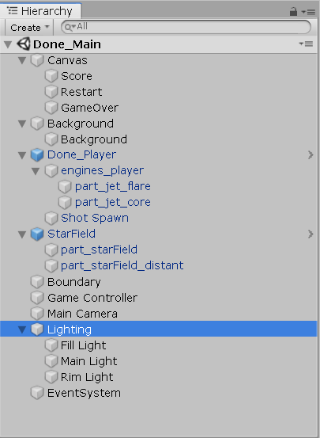
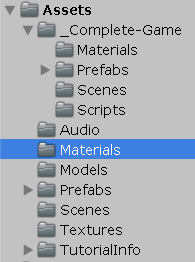
#### 编写一个代码，使用 debug 语句来验证 MonoBehaviour 基本行为或事件触发的条件
* 基本行为包括 Awake() Start() Update() FixedUpdate() LateUpdate()
* 常用事件包括 OnGUI() OnDisable() OnEnable()

代码如下
```
//TestBeh.cs
using System.Collections;
using System.Collections.Generic;
using UnityEngine;

public class TestBeh : MonoBehaviour
{
    //First run in project
    void Awake()
    {
        Debug.Log("Init Awake");
    }
    // Start is called before the first frame update
    void Start()
    {
        Debug.Log("Init Start");
    }

    // Update is called once per frame
    void Update()
    {
        Debug.Log("Init Update");
    }

    //FixedUpdate is called every fixed frame-rate frame.
    void FixedUpdate()
    {
        Debug.Log("Init FixedUpdate");
    }

    //LateUpdate is called after all Update functions have been called.
    void LateUpdate()
    {
        Debug.Log("Init LateUpdate");
    }

    //OnGUI is called for rendering and handling GUI events.
    void OnGUI()
    {
        Debug.Log("Init OnGUI");
    }

    //OnDisable is called when the behaviour becomes disabled.
    void OnDisable()
    {
        Debug.Log("Init OnDisable");
    }

    //OnEnable is called when the object becomes enabled and active.
    void OnEnable()
    {
        Debug.Log("Init OnEnable");
    }
}
```

结果如下    
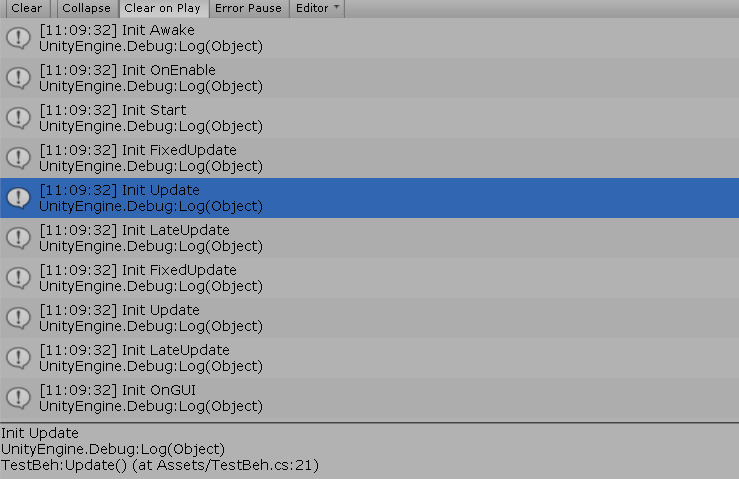
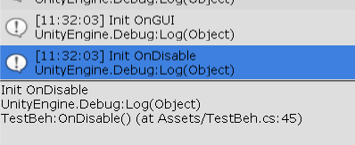

分析：  
Awake() : 当前控制脚本实例被装载的时候调用。一般用于初始化整个事例使用。如图，在游戏对象一开始被加载时执行。

Start() : 当前控制脚本第一次执行Update之前调用。

Update() : 每帧都执行一次，是最常用的时间函数。

FixedUpdate() : 每固定帧绘制时执行一次，和Update不同的是FixedUpdate是渲染帧执行，如果你的渲染效率低下的时候FixedUpdate的调用次数就会下降，可以通过Time.fixedDeltaTime调整固定帧的频率。FixedUpdate比较适用于物理引擎的计算，因为是跟每帧渲染有关，而Update比较适合做控制（放置游戏基本物理行为的代码，在Update之后执行）。在我的执行中，以一个固定的频率执行。

LateUpdate() : 在调用所有Update之后调用lateupdate，适用于于命令脚本执行。例如，跟踪摄影机可以使用lateupdate实现，当它跟踪在update中移动的对象，应该在对象update之后才移动。

OnEnable() : 当对象变为可用或激活状态时此函数被调用，OnEnable不能用于协同程序。在游戏最开始加载时执行了一次。

OnDisable() : 当对象变为不可用或非激活状态时此函数被调用。当物体销毁时它被调用，并且可用于任意清理代码。当脚本编译完成之后被重新加载时，OnDisable将被调用，OnEnable在脚本被载入后调用。当结束执行时，执行一次OnDisable。

OnGUI() : 绘制GUI时候触发。一般在这个函数里绘制GUI菜单。我执行之后，OnGUI会在以一定的频率（随着updae）执行。


#### 查找脚本手册，了解 GameObject，Transform，Component 对象
* 分别翻译官方对三个对象的描述（Description）

    GameObject:Base class for all entities in Unity Scenes. Unity场景中所有实体的基类。  
    Transform:Position, rotation and scale of an object. 对象的位置，旋转角以及尺寸。  
    Component:Base class for everything attached to GameObjects. 所有附加到游戏对象的基类。 

* 描述下图中 table 对象（实体）的属性、table 的 Transform 的属性、 table 的部件
    * 本题目要求是把可视化图形编程界面与 Unity API 对应起来，当你在 Inspector 面板上每一个内容，应该知道对应 API。
    * 例如：table 的对象是 GameObject，第一个选择框是 activeSelf 属性。


        如图，table对象的属性的第一个选择框就是 activeSelf 属性，用于确定此对象是否出现在场景中，然后还有Tag和Layer等属性。  
        table的Transform属性包括Position、Rotation和Scale，分别确定对象的位置，旋转角还有大小。  
        table的部件包括Mesh Filter、Box Collider、Mesh Renderer 还有component（可以添加脚本）。

        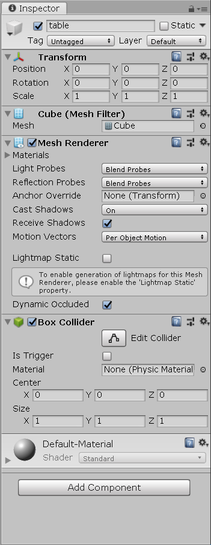

    * 用 UML 图描述 三者的关系（请使用 UMLet 14.1.1 stand-alone版本出图）
        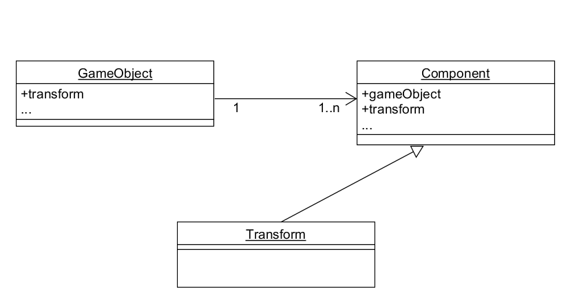


#### 整理相关学习资料，编写简单代码验证以下技术的实现：
* 查找对象

    ```
    using System.Collections;
    using System.Collections.Generic;
    using UnityEngine;

    public class FindObj : MonoBehaviour
    {
        // Start is called before the first frame update
        void Start()
        {
            var toFind = GameObject.Find("table");

            if (toFind != null)
                Debug.Log(toFind);
            else
                Debug.Log("Not Found");
        }

        // Update is called once per frame
        void Update()
        {
            
        }
    }
    ```

    结果如下，找到了table所以输出table。  
    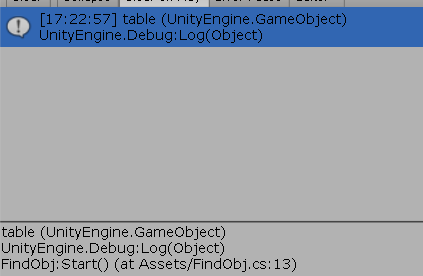

* 添加子对象

    ```
    using System.Collections;
    using System.Collections.Generic;
    using UnityEngine;

    public class AddObj : MonoBehaviour
    {
        // Start is called before the first frame update
        void Start()
        {
            GameObject subObj = GameObject.CreatePrimitive(PrimitiveType.Cube);
            subObj.name = "subObj";
            subObj.transform.position = new Vector3(0, Random.Range(0, 5), 0);
            subObj.transform.parent = this.transform;
        }

        // Update is called once per frame
        void Update()
        {
            
        }
    }
    ```

    结果如下，在图中多了一个在之上的cube，不过在这里我把子对象加在了空对象init之上了。  
    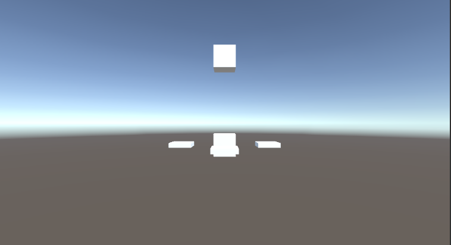

* 遍历对象树

    ```
    using System.Collections;
    using System.Collections.Generic;
    using UnityEngine;

    public class Traverse : MonoBehaviour
    {
        // Start is called before the first frame update
        void Start()
        {
            foreach (Transform child in transform)
            {
                Debug.Log(child.gameObject.name);
            }
        }

        // Update is called once per frame
        void Update()
        {
            
        }
    }
    ```

    用foreach就可以遍历每个子对象。  
    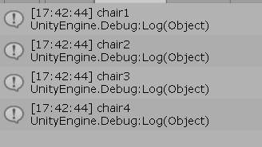


* 清除所有子对象
    ```
    using System.Collections;
    using System.Collections.Generic;
    using UnityEngine;

    public class ClearChild : MonoBehaviour
    {
        // Start is called before the first frame update
        void Start()
        {
            foreach (Transform child in transform)
            {
                Destroy(child.gameObject);
            }
        }

        // Update is called once per frame
        void Update()
        {
            
        }
    }
    ```
    先遍历每个child，然后逐个destroy。结果如下，table下的chair都没有了。

    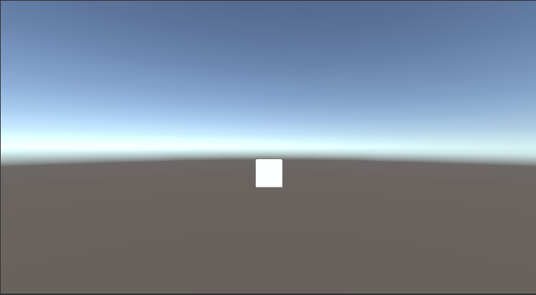

#### 资源预设（Prefabs）与 对象克隆 (clone)
* 预设（Prefabs）有什么好处？

    预设相当于一个模板，我们可以将gameobject组合起来制作成预设，以供自己下次使用，或者在别的项目中作为素材使用。所以预设可以在出错时快速恢复，以减少重新制作的麻烦；然后还可以制作成一个对象的成品，在游戏制作当中使用。

* 预设与对象克隆 (clone or copy or Instantiate of Unity Object) 关系？

    制作预设的过程中就需要使用到对象克隆，克隆包装在一个初始化的预设当中。而同时预设也使对象克隆变得更简单，制作好的预设只需拖拉就可以克隆出一个一模一样的对象。

* 制作 table 预制，写一段代码将 table 预制资源实例化成游戏对象  

    将 table 预制资源实例化成游戏对象有两种方法，分别为：
    1. 创建一个行为对象，Tranform 或 GameObject 类型的table 作为 public变量。直接从预制拖入该变量使用。
    2. 利用 Resources.Load(“table”) 加载。

    第一种在课堂上试过了，所以这里尝试第二种。**需要注意此时应该把预设放置在Resources目录下（自行创建）。**

    ```
    using System.Collections;
    using System.Collections.Generic;
    using UnityEngine;

    public class LoadPrefab : MonoBehaviour
    {
        // Start is called before the first frame update
        void Start()
        {
            Debug.Log("start!");
            GameObject table = Instantiate(Resources.Load("table", typeof(GameObject))) as GameObject;
            table.transform.position = new Vector3(0, Random.Range(5, 7), 0);
            table.transform.parent = this.transform;
        }

        // Update is called once per frame
        void Update()
        {
            
        }
    }
    ```

    结果如下：

    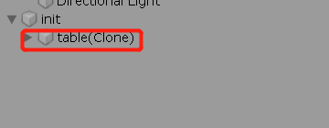

    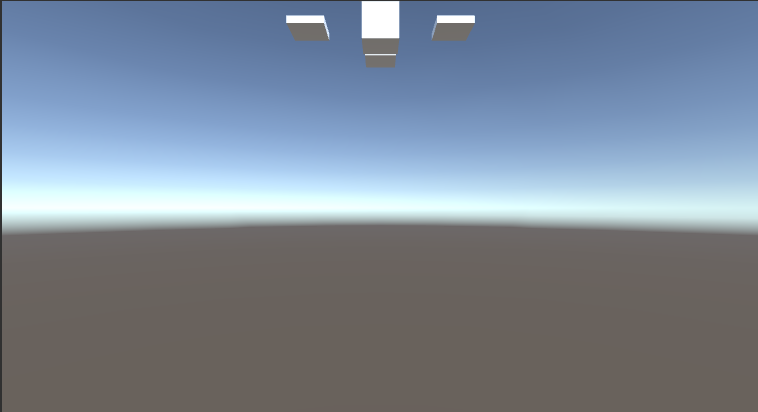

### 2、 编程实践，小游戏

* 游戏内容： 井字棋 或 贷款计算器 或 简单计算器 等等
* 技术限制： 仅允许使用 IMGUI 构建 UI
* 作业目的：
    * 了解 OnGUI() 事件，提升 debug 能力
    * 提升阅读 API 文档能力

#### 游戏封面
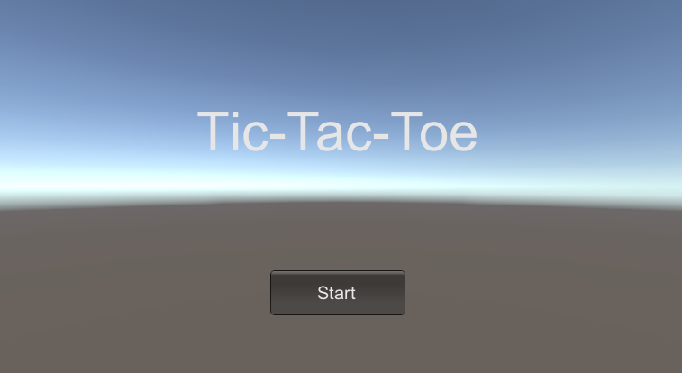

#### 代码
```
//Tic_Tac_Toe.cs
using System;
using System.Collections;
using System.Collections.Generic;
using UnityEngine;

public class Tic_Tac_Toe : MonoBehaviour
{
    // 0 presents nothing, 1 presents "O", 2 presents "X"
    private int[,] chess = new int[3, 3];
    private int turn = 1;
    private bool start = false;

    //Reset the game
    private void Reset()
    {
        turn = 1;
        for (int i = 0; i < 3; i++)
        {
            for (int j = 0; j < 3; j++)
            {
                chess[i, j] = 0;
            }
        }
    }

    private int isWin()
    {
        //Vertical same
        for (int i = 0; i < 3; i++)
        {
            if (chess[i, 0] != 0 && chess[i, 0] == chess[i, 1] && chess[i, 0] == chess[i, 2])
            {
                return chess[i, 0];
            }
        }

        //Parallel same
        for (int j = 0; j < 3; j++)
        {
            if (chess[0, j] != 0 && chess[0, j] == chess[1, j] && chess[0, j] == chess[2, j])
            {
                return chess[0, j];
            }
        }

        //diagonal same
        if (chess[0, 0] != 0 && chess[0, 0] == chess[1, 1] && chess[0, 0] == chess[2, 2]) return chess[1, 1];
        if (chess[0, 2] != 0 && chess[0, 2] == chess[1, 1] && chess[0, 2] == chess[2, 0]) return chess[1, 1];

        //Judge if it's locked
        for (int i = 0; i < 3; i++)
        {
            for (int j = 0; j < 3; j++)
            {
                if (chess[i, j] == 0)
                {
                    return 0;
                }
            }
        }
        return 3;
    }

    // Start is called before the first frame update
    void Start()
    {
        start = false;
        Reset();  
    }

    //Generate GUI
    void OnGUI()
    {
        GUI.skin.button.fontSize = 20;
        GUI.skin.label.fontSize = 30;
        if (!start)
        {
            if (GUI.Button(new Rect(300, 300, 150, 50), "Start"))
            {
                start = true;
            }
            GUI.skin.label.fontSize = 60;
            GUI.Label(new Rect(218, 110, 314, 100), "Tic-Tac-Toe");
        }
        else
        {
            if (GUI.Button(new Rect(300, 340, 150, 50), "Reset"))
            {
                Reset();
            }

            int state = isWin();
            if (state == 1)
            {
                GUI.Label(new Rect(322, 20, 106, 50), "O Wins!");
            }
            else if (state == 2)
            {
                GUI.Label(new Rect(323, 20, 104, 50), "X Wins!");
            }
            else if (state == 3)
            {
                GUI.Label(new Rect(284, 20, 182, 50), "No one Wins.");
            }
            else
            {
                if (turn == 1)
                    GUI.Label(new Rect(364, 6, 22, 50), "O");
                else if (turn == 2)
                    GUI.Label(new Rect(364, 20, 22, 50), "X");
            }
            

            for (int i = 0; i < 3; i++)
            {
                for (int j = 0; j < 3; j++)
                {
                    if (chess[i, j] == 1)
                    {
                        GUI.Button(new Rect(i * 80 + 255, j * 80 + 80, 80, 80), "O");
                    }
                    else if (chess[i, j] == 2)
                    {
                        GUI.Button(new Rect(i * 80 + 255, j * 80 + 80, 80, 80), "X");
                    }

                    if (GUI.Button(new Rect(i * 80 + 255, j * 80 + 80, 80, 80), "") && state == 0)
                    {
                        chess[i, j] = turn;
                        turn = 3 - turn;
                    }
                }
            }
        }
    }
 
}
```

#### 视频演示

游戏开始：

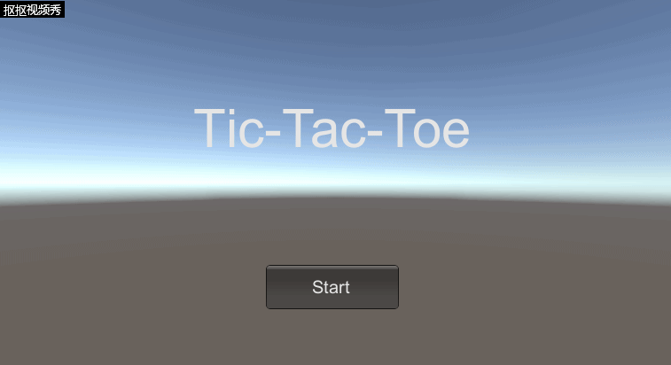

游戏ing（无人胜出版）：

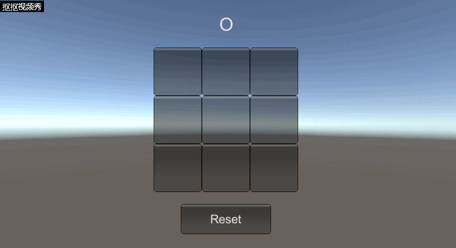

游戏ing（O 胜出版）：

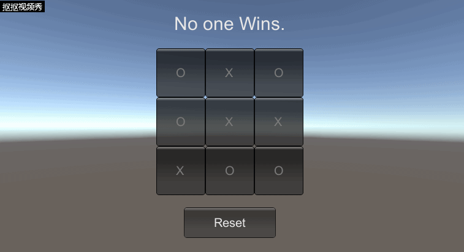
