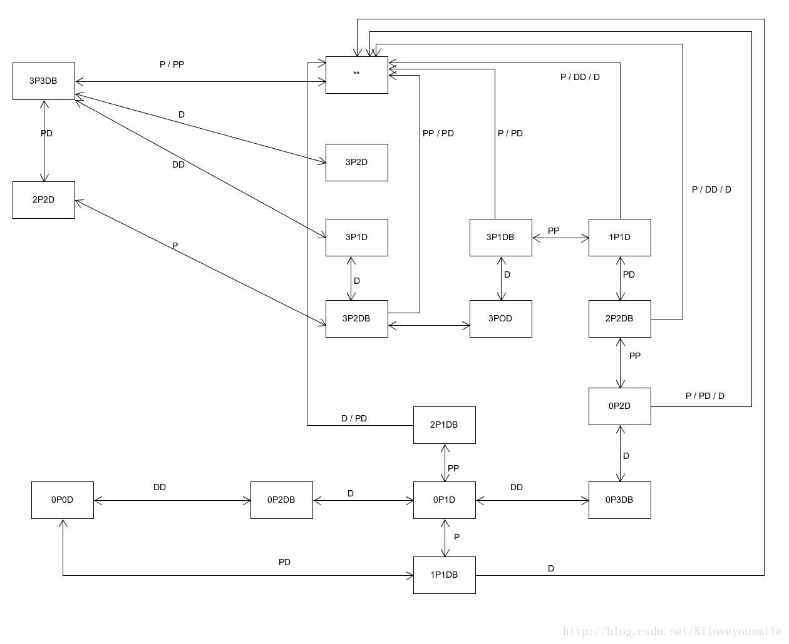

## 第十次作业

本次作业基本要求是三选一，我选择了P&D 过河游戏智能帮助实现

3、P&D 过河游戏智能帮助实现，程序具体要求：

* 实现状态图的自动生成
* 讲解图数据在程序中的表示方法
* 利用算法实现下一步的计算
* 参考：[P&D 过河游戏智能帮助实现](https://blog.csdn.net/kiloveyousmile/article/details/71727667)

### 状态图
以下状态图摘自上面的参考博客，主要表示了3个牧师与3个魔鬼的游戏所有可能出现的状况。而如果要实现智能游戏帮助，则需要用代码的形式自动生成以下状态图。


### 实现方法
刚好在结束的实训中学习到了两大类搜索算法（盲目式搜索与启发式搜索），这两大搜索方法都能以较快的速率遍历状态图的所有状态，这样就可以找到一条通往游戏结束状态的路径。由于此游戏状态比较少，经过测试速度也还可以，所以我就使用了广度优先搜索的方法寻找路径（使用启发式搜索的A*算法会更加趋向于终点）。
#### 图的表示方法
要实现路径的搜索，首先要将状态图抽象为一个数据结构。我选择使用邻接表表示图，所以每个状态就用一个自定义节点```PAndDNode```来表示。

以下是实现这个状态节点的```PAndDNode```类，首先需要解释一下```PAndDNode```的一些属性：  
1. priestsNum：用于记录还未转移到目的地的牧师个数
2. devilsNum：用于记录还未转移到目的地的魔鬼的个数
3. parent：相当于指针，指向发展到这个状态的状态父节点  

除了上面的属性，我还未这个状态节点定义了一些行为，以方便后面BFS算法的实现：
1. ```public bool IsValid()```：判断该状态是否合法，也就是判断此状态是否导致游戏失败
2. ```public bool Move(int path)```：将此状态转移到下一状态，在图论中就是访问邻接点。这里每种状态都会有5个邻接状态可以转移（当然实际种不是每个状态都能有5个，所以会在实现的5个Move函数中判断是否能够执行该转移），所以根据输入的int数来指引到相应的Move函数中。
3. 其他的还有构造函数以及属性的get函数，还有需要重写节点的比较函数Equals及其绑定在一起的函数。

```
public class PAndDNode
{
    private const int maxPriests = 3;
    private const int maxDevils = 3;

    int priestsNum;
    int devilsNum;
    private PAndDNode parent;

    public PAndDNode(int priestsNum, int devilsNum)
    {
        if (priestsNum <= maxPriests && devilsNum <= maxDevils)
        {
            this.priestsNum = priestsNum;
            this.devilsNum = devilsNum;
            this.parent = null;
        }
        else
        {
            Debug.Log("传参错误");
        }
    }

    public PAndDNode(PAndDNode node)
    {
        this.priestsNum = node.priestsNum;
        this.devilsNum = node.devilsNum;
        this.parent = node.parent;
    }

    public int GetPriestsNum()
    {
        return priestsNum;
    }

    public int GetDevilsNum()
    {
        return devilsNum;
    }

    public PAndDNode GetParent()
    {
        return parent;
    }

    public override bool Equals(object obj)
    {
        if (obj == null || obj.GetType().Equals(this.GetType()) == false)
        {
            return false;
        }

        PAndDNode node = (PAndDNode)obj;
        if (node.priestsNum == this.priestsNum && node.devilsNum == this.devilsNum)
        {
            return true;

        }
        return false;
    }

    public override int GetHashCode()
    {
        return this.priestsNum.GetHashCode() + this.devilsNum.GetHashCode();
    }

    public bool IsValid()
    {
        return ((priestsNum >= devilsNum || priestsNum  == 0) && (priestsNum <= devilsNum || priestsNum == maxPriests));
    }

    public bool MoveDD()
    {
        if (devilsNum >= 2)
        {
            this.parent = new PAndDNode(this);
            devilsNum -= 2;
            return true;
        }
        return false;
    }

    public bool MoveDP()
    {
        if (priestsNum > 0 && devilsNum > 0)
        {
            this.parent = new PAndDNode(this);
            devilsNum--;
            priestsNum--;
            return true;
        }
        return false;
    }

    public bool MovePP()
    {
        if (priestsNum >= 2)
        {
            this.parent = new PAndDNode(this);
            priestsNum -= 2;
            return true;
        }
        return false;
    }

    public bool MoveD()
    {
        if (devilsNum > 0)
        {
            this.parent = new PAndDNode(this);
            devilsNum--;
            return true;
        }
        return false;
    }

    public bool MoveP()
    {
        if (priestsNum > 0)
        {
            this.parent = new PAndDNode(this);
            priestsNum--;
            return true;
        }
        return false;
    }

    public bool Move(int path)
    {
        switch (path) {
            case 0:
                return MoveDP();
            case 1:
                return MovePP();
            case 2:
                return MoveDD();
            case 3:
                return MoveP();
            case 4:
                return MoveD();
            default:
                return false;
        }
    }
}
```

#### 广度优先搜索
广度优先搜索算法在```PAndD```类中实现，代码如下。

使用BFS寻找路径主要在```public bool BFSearch(PAndDNode begin, PAndDNode end)```函数中，函数接受起始节点，以及目标节点（这里目标节点固定为牧师数和恶魔数都是0，而起始节点则根据游戏当时状态决定）。当到达目标终点后，会调用```setNextToMove()```回溯这条路径找到此时状态应该转移的合法状态，然后返回```true```。所以调用者如果判断返回值为```true```就可以调用```GetNextToMove()```获取下一转移状态。

BFS实现中主要要注意的点是，什么才算访问邻接点，不仅要判断其是否能由该节点转移得到（也就是是否为邻接点）和其是否访问过，还有调用节点提供的方法```IsValid()```来判断这个状态是否会导致玩家游戏失败。

BFS是实时进行的，当然搜索的速度也非常喜人，能够很好地作为智能帮助的底层算法。

```
public class PAndD
{
    private const int pathNum = 5;

    private PAndDNode beginNode;
    private PAndDNode endNode;
    private PAndDNode nextNode;
    private PAndDNode currentNode;

    public bool BFSearch(PAndDNode begin, PAndDNode end)
    {
        Queue<PAndDNode> openList = new Queue<PAndDNode>();
        List<PAndDNode> closeList = new List<PAndDNode>();
        openList.Enqueue(begin);

        this.beginNode = begin;
        this.endNode = end;

        while (openList.Count > 0)
        {
            this.currentNode = openList.Peek();

            if (this.currentNode.Equals(end))
            {
                setNextToMove();
                return true;
            }
            openList.Dequeue();
            closeList.Add(this.currentNode);

            for (int i = 0; i < pathNum; i++)
            {
                PAndDNode newNode = new PAndDNode(this.currentNode);
                if (newNode.Move(i) && !closeList.Contains(newNode) && newNode.IsValid())
                {
                    openList.Enqueue(newNode);
                }
            }
        }

        return false;
    }

    private void setNextToMove()
    {
        nextNode = this.currentNode;
        while (!nextNode.GetParent().Equals(beginNode))
        {
            nextNode = nextNode.GetParent();
        }
    }

    public PAndDNode GetNextToMove()
    {
        return nextNode;
    }
}
```

### P&D 过河游戏拓展
实现了游戏帮助的底层算法，接下来就要将该算法植入到原来的游戏当中，并扩展一个提示功能。首先我先在```interface IUserAction```增加一个需要实现的功能函数```bool Tips()```。然后扩展用户GUI，增加一个Tips按钮，当被点击时调用该```Tips()```函数。最后在```FirstController```中实现该函数,实现如下:

流程为首先获取当前出发Land上的牧师与魔鬼的个数（当然还有包含船上的个数,因为节点保存的是未到达终点的个数）。然后以此调用```PAndD```的```BFSearch```函数，找到一条可以通往节点的路径，并获取下一步需要转移的状态（主要是下一状态岸上还剩的牧师魔鬼数）。如果能够找到这样一条路径，那么就进行自动移动。

自动移动实现为自动将要转移的牧师和魔鬼放上船上（这里是根据下一状态节点的剩下牧师魔鬼数与当前牧师魔鬼数对比获取要转移的牧师魔鬼数），还能矫正玩家行为，也就是如果已在船上但又不该转移的牧师或魔鬼移动回岸上，再把需要转移的牧师或魔鬼转移到船上。

```
public bool Tips()
{
    int[] fromCount = fromLand.GetCharacterNum();
    int[] boatCount = boat.GetCharacterNum();
    PAndD solution = new PAndD();

    if (solution.BFSearch(new PAndDNode(fromCount[0] + boatCount[0], fromCount[1] + boatCount[1]), new PAndDNode(0, 0))) 
    {
        // 船在左边
        if (fromLand.GetToOrFrom() != boat.GetToOrFrom())
        {
            return false;
        }

        PAndDNode nextToMove = solution.GetNextToMove();
        CharacterModel[] fromCharacters = fromLand.GetCharacters();

        int pNum = fromCount[0] - nextToMove.GetPriestsNum();
        int dNum = fromCount[1] - nextToMove.GetDevilsNum();

        foreach (CharacterModel character in boat.GetCharacters())
        {
            if (pNum >= 0)
                break;
            if (character != null && character.GetType() == 0)
            {
                MoveCharacter(character);
                pNum++;
            }
        }

        foreach (CharacterModel character in boat.GetCharacters())
        {
            if (dNum >= 0)
                break;
            if (character != null && character.GetType() == 1)
            {
                MoveCharacter(character);
                dNum++;
            }
        }

        for (int i = 0; i < pNum; i++)
        {
            foreach (CharacterModel character in fromCharacters)
            {
                if (character != null && character.GetType() == 0)
                {
                    MoveCharacter(character);
                    break;
                }
            }
        }

        for (int i = 0; i < dNum; i++)
        {
            foreach (CharacterModel character in fromCharacters)
            {
                if (character != null && character.GetType() == 1)
                {
                    MoveCharacter(character);
                    break;
                }
            }
        }
        return true;
    }
    return false;
}
```

### 结果展示
演示视频：[https://v.youku.com/v_show/id_XNDQ1Njg4ODI3Ng==.html?spm=a2hzp.8244740.0.0](https://v.youku.com/v_show/id_XNDQ1Njg4ODI3Ng==.html?spm=a2hzp.8244740.0.0)