## 第十一次作业
### 1、 图片识别与建模
由于新版本的unity和vuforia已经更新不少，所以遇到了不少坑，现在我就详细说一下我在unity上配置vuforia的过程。（版本：unity 2018.4以及vuforia 8.6）

#### 创建证书与添加数据库
* 首先需要注册登陆一个账户，然后在以下页面点击Get Development Key（我已经获取了，所以有一个3d Course的license）。
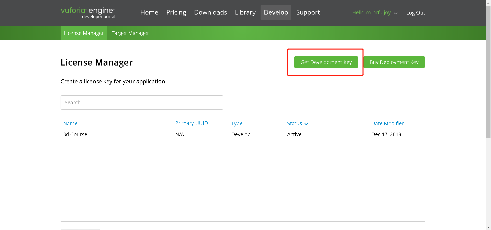

* 然后点击新建的license进去，出现以下页面，未来需要以下的license key，先保留。
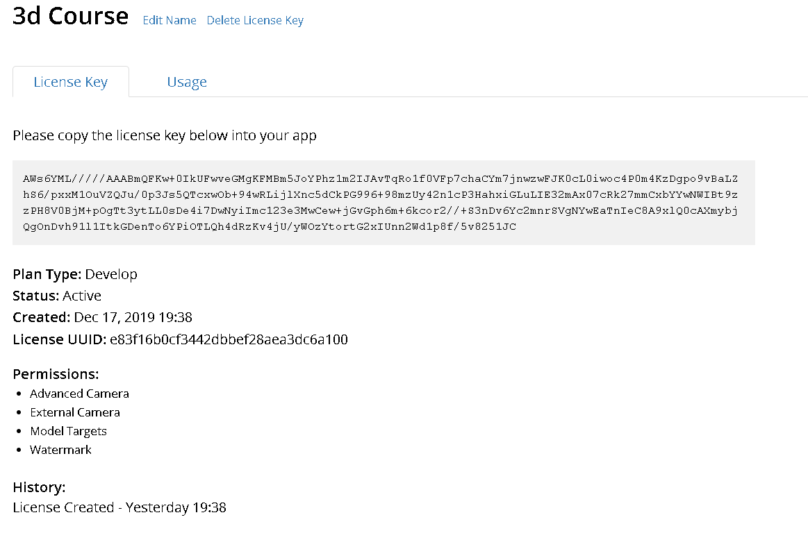

* 然后点击Target Manager进行数据库添加。
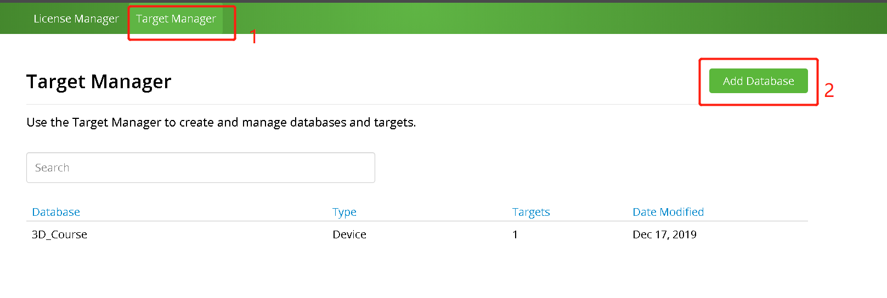

* 接着就需要点击新创建的数据库，我这里就是3D_Course。点击Add Target，并如下配置。
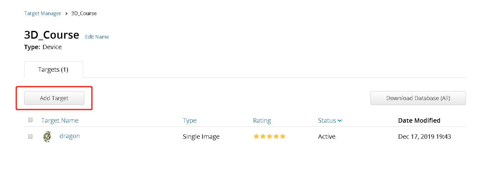
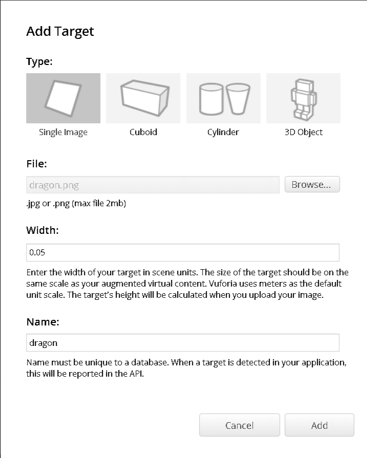

#### 下载Unity扩展包
这一步与课程网上的大有不同，需要注意！

* 在官网Downloads页面，选择以下包进行下载。
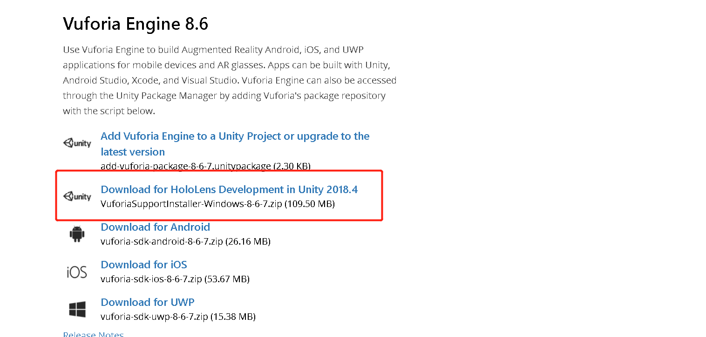

* 下载后为一个压缩包，里面有一个安装器，点击运行，出现以下界面。


* 一直点击Next（前面没有什么需要自定义的），然后直到需要选择Destination Folder。
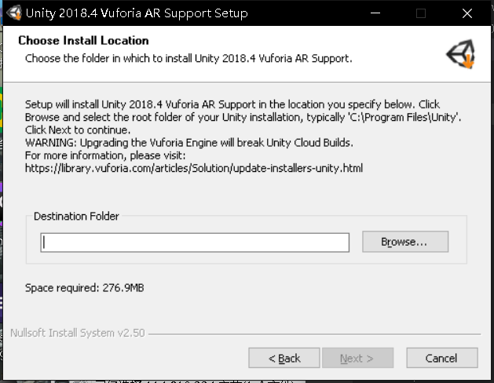

* 这里需要注意并不是选择Unity.exe所在的目录，而是Editor目录所在的目录。如我的Unity.exe在目录G:\software\Editor\Unity.exe下，所以我需要选择G:\software\。这里一定要注意，否则会出现Failed to locate Unity.exe的错误。
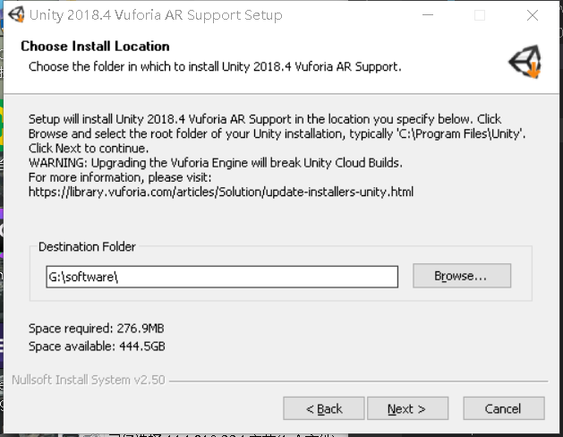

* 接着直接就可以开始安装，如果需要有关闭的程序关闭即可。

#### 导入Unity扩展包
* 通过上面的安装器安装，现在Unity中以及内嵌了Vuforia engine。
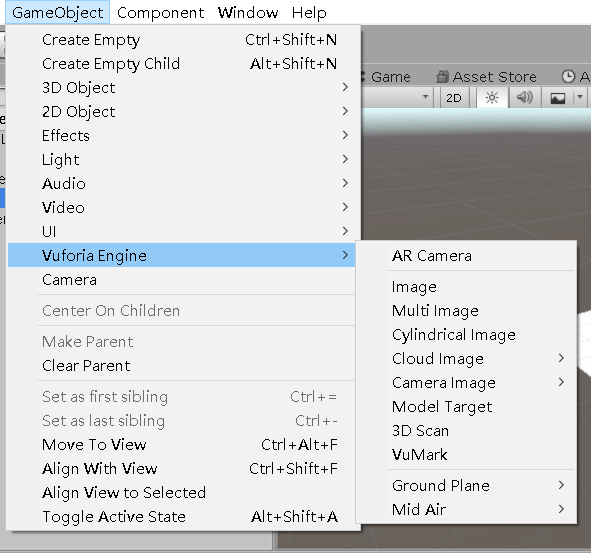

* 同时出现了一个Resources的包，里面含有VuforiaConfiguration，这是Vuforia的配置文件。这时在配置文件中可能会出现以下警告，这是就需要更改player setting。
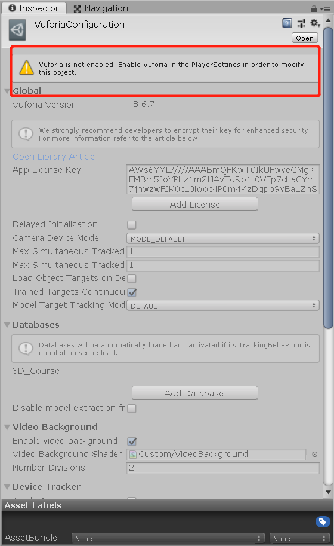

* 点击Edit，然后点击Project Settings，找到Player，勾选以下两个选项。
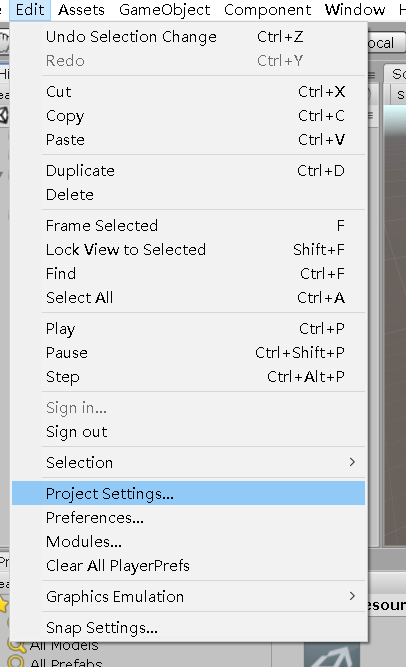
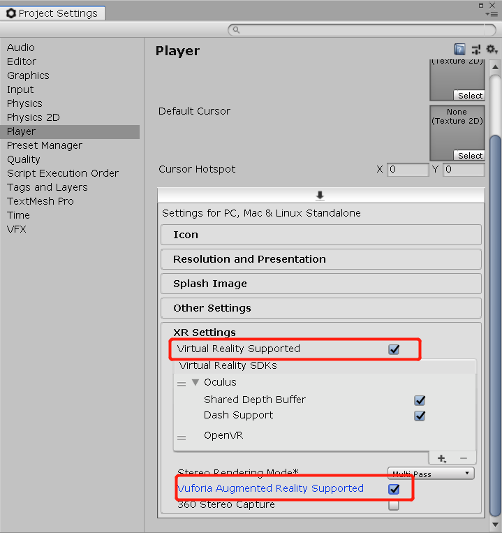

* 现在使用AR Camera作为唯一的Camera然后运行就能看到摄像头实景。

#### 添加数据库
* 回到官网，复制下之前提到的license key，然后粘贴到配置文件下。
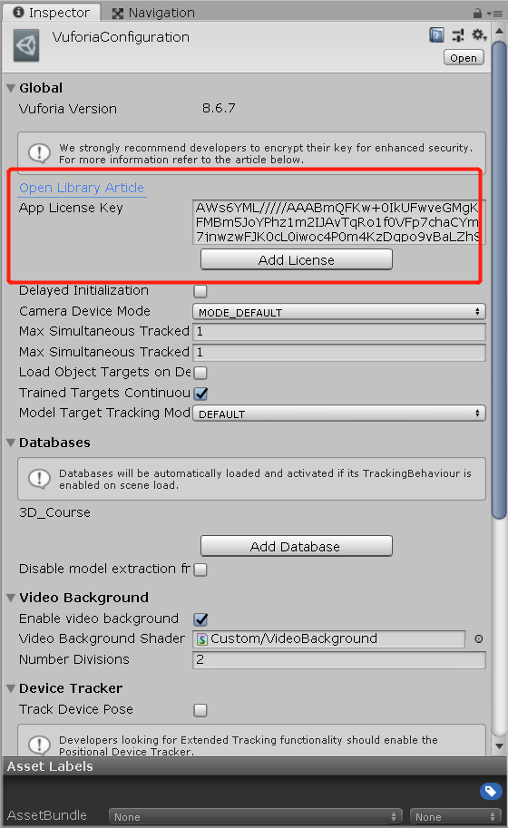

* 接着在刚才的数据库页面点击Download Database按钮，选择Unity Editor进行下载。
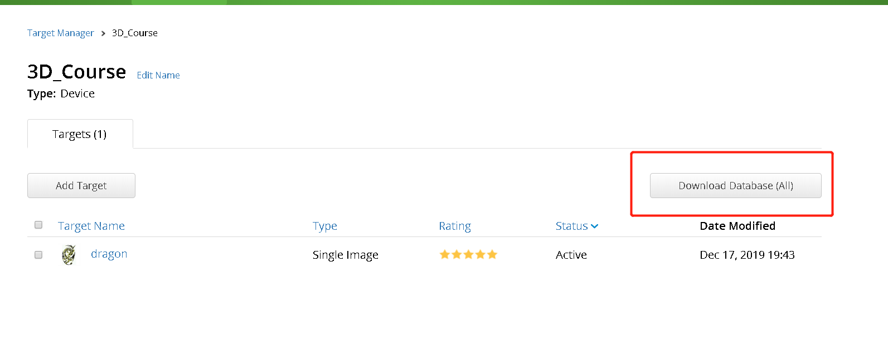
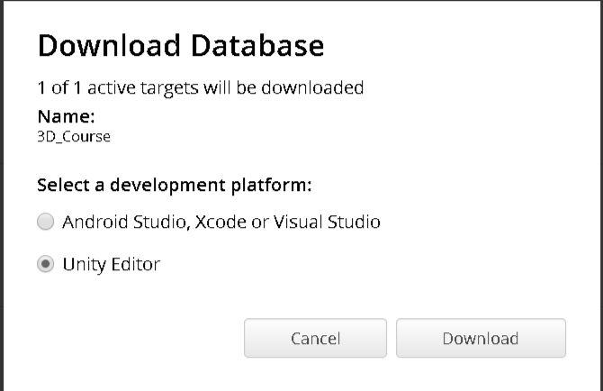

* 下载完成后为一个package，在unity中import即可。这个时候配置文件就会自动加载新import的数据库。
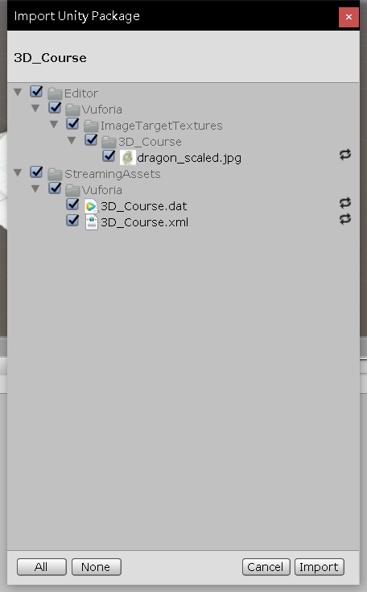

#### 运行项目
* 之前都是只看得到摄像机实景，现在搞一些神奇的东西。首先添加一个ImageTarget。
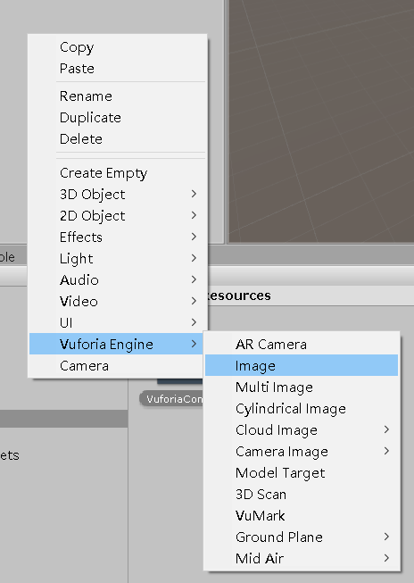

* 添加成功后，把import进来的数据库里的dragon-scaled.jpg添加到ImageTarget上去。
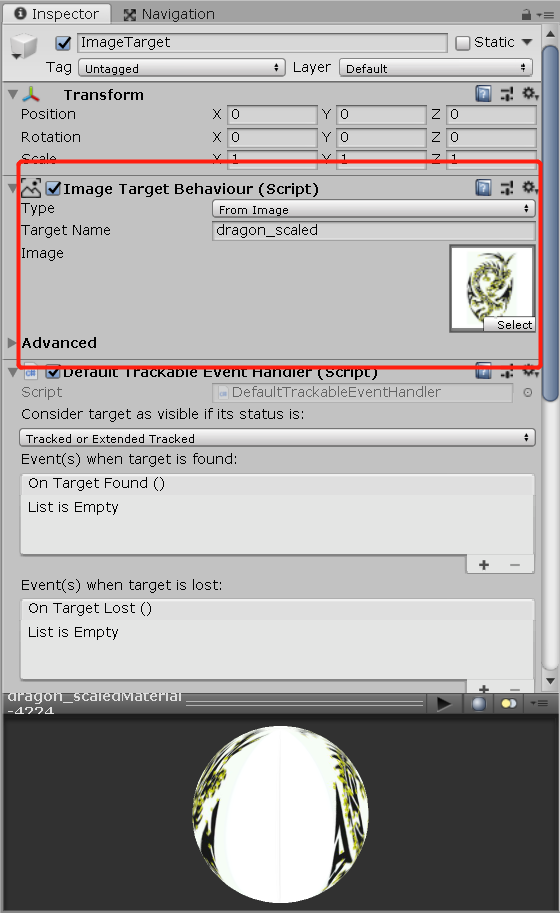

* 最后在ImageTarget下添加一个你想要出现的物体，我这里为了简单演示就添加一个cube。
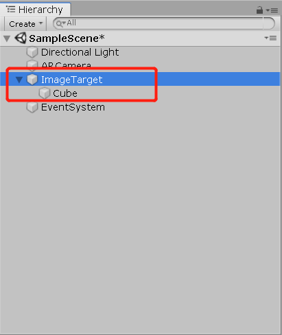

* 调整物体的位置大小，然后运行。就会发现在摄像机面前出现的龙图上会出现cube。
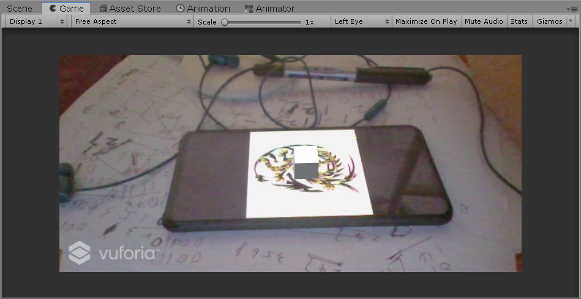

至此，Vuforia的简单使用就已经完成了，接下来就需要进一步添加更好玩的功能。

### 2、 虚拟按键小游戏
这部分内容只是在上面的基础上添加了一条龙，也为这条龙添加了一些基本的动作（左转右转）。

脚本：添加了两个按钮，用于控制其左转右转。
```
using System.Collections;
using System.Collections.Generic;
using UnityEngine;

public class UserGUI : MonoBehaviour
{
    public GameObject dragon;// 龙
    private bool isMove = false;
    Vector3 dest;
    public float speed = 0.05f;

    void OnGUI()
    {
        if (GUI.Button(new Rect(50, Screen.height - 100, 90, 45), "左转"))
        {
            dragon.transform.Rotate(new Vector3(0, -90, 0));
        }
        if (GUI.Button(new Rect(560, Screen.height - 100, 90, 45), "右转"))
        {
            dragon.transform.Rotate(new Vector3(0, 90, 0));
        }
    }
}

```

结果截图：
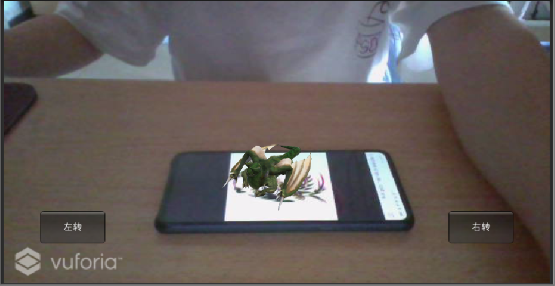