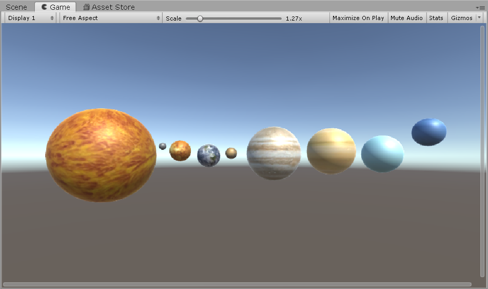
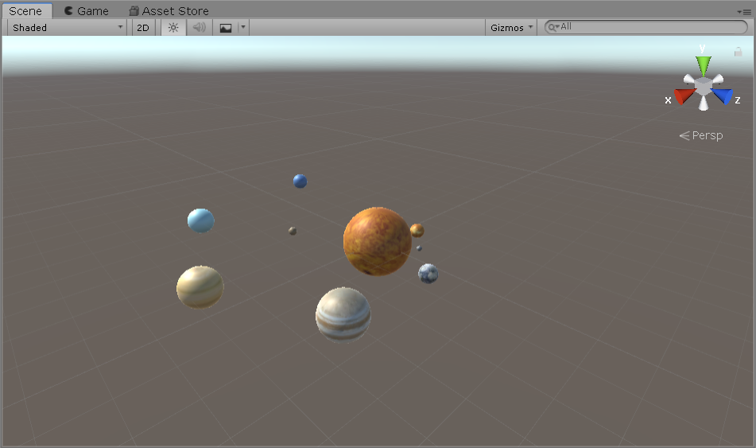
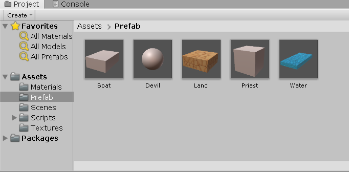
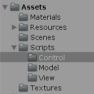
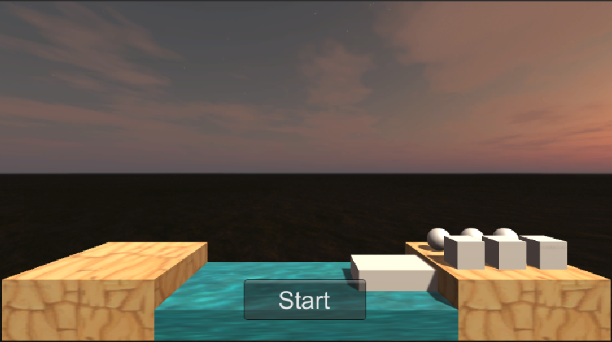
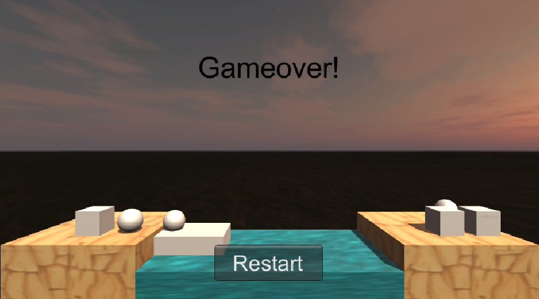
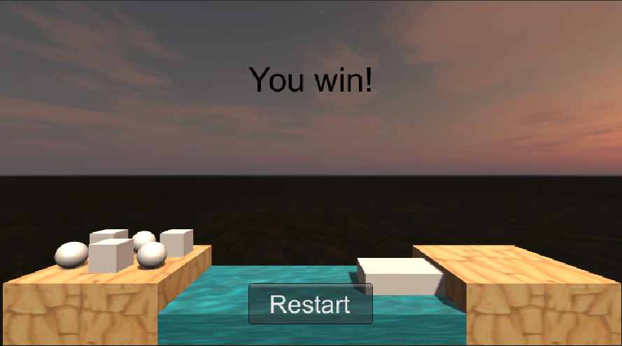

# 第三次作业

### 1、简答并用程序验证

#### 游戏对象运动的本质是什么？

游戏运动本质就是使用矩阵变换（平移、旋转、缩放）改变游戏对象的空间属性。其空间属性就包括position、rotation、scale，这些属性控制着游戏对象的运动，分别控制着平移、旋转、缩放。

#### 请用三种方法以上方法，实现物体的抛物线运动。（如，修改Transform属性，使用向量Vector3的方法…）

1. 修改Transform属性
```
using System.Collections;
using System.Collections.Generic;
using UnityEngine;

public class parabolic : MonoBehaviour
{
    public float v0;
    public float v1;
    public float a;

    // Start is called before the first frame update
    void Start()
    {
        
    }

    // Update is called once per frame
    void Update()
    {
        v1 += a * Time.deltaTime;
        transform.position += (Vector3.left * v0 + Vector3.down * v1) * Time.deltaTime;      
    }
}

```

2. 使用向量Vector3的方法
```
using System.Collections;
using System.Collections.Generic;
using UnityEngine;

public class parabolic : MonoBehaviour
{
    public float v0;
    public float v1;
    public float a;

    // Start is called before the first frame update
    void Start()
    {
        
    }

    // Update is called once per frame
    void Update()
    {
        v1 += a * Time.deltaTime;
        transform.position = Vector3.MoveTowards(transform.position, transform.position + (Vector3.left * v0 + Vector3.down * v1) * Time.deltaTime, 1);
    }
}

```

3. 使用transform的
```
using System.Collections;
using System.Collections.Generic;
using UnityEngine;

public class parabolic : MonoBehaviour
{
    public float v0;
    public float v1;
    public float a;

    // Start is called before the first frame update
    void Start()
    {
        
    }

    // Update is called once per frame
    void Update()
    {
        v1 += a * Time.deltaTime;
        transform.Translate((Vector3.left * v0 + Vector3.down * v1) * Time.deltaTime);
    }
}

```

#### 写一个程序，实现一个完整的太阳系， 其他星球围绕太阳的转速必须不一样，且不在一个法平面上。

**Script：**
```
using System.Collections;
using System.Collections.Generic;
using UnityEngine;

public class SolarSystem : MonoBehaviour
{
    // Start is called before the first frame update
    void Start()
    {
        
    }

    // Update is called once per frame
    void Update()
    {
        GameObject.Find("Mercury").transform.RotateAround(Vector3.zero, new Vector3(-1, 6, 0), 25 * Time.deltaTime);
        GameObject.Find("Mercury").transform.Rotate(Vector3.up * Time.deltaTime * 10000);
        GameObject.Find("Venus").transform.RotateAround(Vector3.zero, new Vector3(-5, 79, 0), 20 * Time.deltaTime);
        GameObject.Find("Venus").transform.Rotate(Vector3.up * Time.deltaTime * 10000);
        GameObject.Find("Earth").transform.RotateAround(Vector3.zero, new Vector3(0, 1, 0), 30 * Time.deltaTime);
        GameObject.Find("Earth").transform.Rotate(Vector3.up * Time.deltaTime * 10000);
        GameObject.Find("Mars").transform.RotateAround(Vector3.zero, new Vector3(-25, 1335, 0), 45 * Time.deltaTime);
        GameObject.Find("Mars").transform.Rotate(Vector3.up * Time.deltaTime * 10000);
        GameObject.Find("Jupiter").transform.RotateAround(Vector3.zero, new Vector3(-2, 179, 0), 35 * Time.deltaTime);
        GameObject.Find("Jupiter").transform.Rotate(Vector3.up * Time.deltaTime * 10000);
        GameObject.Find("Saturn").transform.RotateAround(Vector3.zero, new Vector3(-45, 2400, 0), 40 * Time.deltaTime);
        GameObject.Find("Saturn").transform.Rotate(Vector3.up * Time.deltaTime * 10000);
        GameObject.Find("Uranus").transform.RotateAround(Vector3.zero, new Vector3(-15, 2950, 0), 45 * Time.deltaTime);
        GameObject.Find("Uranus").transform.Rotate(Vector3.up * Time.deltaTime * 10000);
        GameObject.Find("Neptune").transform.RotateAround(Vector3.zero, new Vector3(-25, 345, 1), 50 * Time.deltaTime);
        GameObject.Find("Neptune").transform.Rotate(Vector3.up * Time.deltaTime * 10000);
    }
}

```

**上述选择的法向量是根据行星自身与太阳中心平面的夹角决定的，如图：**



**实际运行情况：**



项目文件在[src目录](../src)下的Solar System中。

### 2、编程实践

#### 阅读以下游戏脚本
> Priests and Devils
>  
> Priests and Devils is a puzzle game in which you will help the Priests and Devils to cross the river within the time limit. There are 3 priests and 3 devils at one side of the river. They all want to get to the other side of this river, but there is only one boat and this boat can only carry two persons each time. And there must be one person steering the boat from one side to the other side. In the flash game, you can click on them to move them and click the go button to move the boat to the other direction. If the priests are out numbered by the devils on either side of the river, they get killed and the game is over. You can try it in many > ways. Keep all priests alive! Good luck!

程序需要满足的要求：

* play the game ( http://www.flash-game.net/game/2535/priests-and-devils.html )
* 列出游戏中提及的事物（Objects）
* 用表格列出玩家动作表（规则表），注意，动作越少越好
* 请将游戏中对象做成预制
* 在 GenGameObjects 中创建 长方形、正方形、球 及其色彩代表游戏中的对象。
* 使用 C# 集合类型 有效组织对象
* 整个游戏仅 主摄像机 和 一个 Empty 对象， 其他对象必须代码动态生成！！！ 。 整个游戏不许出现 Find 游戏对象， SendMessage 这类突破程序结构的 通讯耦合 语句。 违背本条准则，不给分
* 请使用课件架构图编程，不接受非 MVC 结构程序
* 注意细节，例如：船未靠岸，牧师与魔鬼上下船运动中，均不能接受用户事件！

#### 过程：
##### 列出游戏中提及的事物（Objects）

魔鬼，牧师，船，河流，两边的陆地


##### 用表格列出玩家动作表（规则表），注意，动作越少越好

| 玩家事件 | 响应条件 | 结果 |
|--|--|--|
| 魔鬼/牧师被点击 | 游戏未结束、船没有在移动、船上少于2个人以及魔鬼/牧师与船在同一边 | 魔鬼/牧师上船 |
| 船被点击 | 游戏未结束、船没有在移动（船移动中不会响应）以及船上至少有一人 | 船移动到另一边陆地 |

##### 请将游戏中对象做成预制



##### 在 GenGameObjects 中创建 长方形、正方形、球 及其色彩代表游戏中的对象。

其中原色正方体代表牧师，原色球体代表恶魔，原始长方体代表船，还有水和陆地

##### 代码（脚本script）

这是项目Assets目录结构，可以看到在Scripts有三个目录，这就是我的MVC结构：



以下是代码解读，由于代码过长我简略具体实现，只把函数体展示出来，而函数内部实现省略。

Model：  
这个模块下，我实现了三个类BoatModel、LandModel以及CharacterModel分别控制船、陆地以及人物的基本动作。然后还要两个辅助类，Click类被加到船和人物的GameObject上，完成响应点击事件的工作；而Moveable也被加到船和人物的GameObject，完成控制其移动的工作。

```
//BoatModel.cs
public class BoatModel
{
    
    //只读变量，如脚本，position等
    //字段

    public BoatModel()
    {
        //实例化预制成一个GameObject，并调整位置，并将两个脚本加到其中
    }

    public void DisableClick()
    {
        //用于在游戏未开始的时候，让点击事件不工作
    }

    public void Move()
    {
        //使用Moveable脚本完成
    }

    public int GetEmptyIndex()
    {
    }

    public bool IsEmpty()
    {
    }

    public Vector3 GetEmptyPosition()
    {
    }

    public void GetOnBoat(CharacterModel character)
    {
        //把要上船的人物，加到该类管理的容器当中
    }

    public CharacterModel GetOffBoat(string name)
    {
        //找到要下船的人物，从集合中移去
    }

    public GameObject GetGameobj()
    {
    }

    public int GetToOrFrom()
    { 
    }

    public int[] GetCharacterNum()
    {
    }

    public void Reset()
    {
        //完成一些重置工作
    }
}

```

```
//LandModel.cs
public class LandModel
{
    //只读变量，如游戏对象，position等
    //字段

    public LandModel(string _toOrFrom)
    {
        //实例化预制为两个陆地的游戏对象，设置好位置。
        //为人物设置好可以站的位置
    }

    public int GetEmptyIndex()
    {
    }

    public Vector3 GetEmptyPosition()
    {
    }

    public void GetOnLand(CharacterModel character)
    {
        //把要上岸的人物，加到该类管理的容器当中
    }

    public CharacterModel GetOffLand(string name)
    {   
         //找到要离开的人物，从集合中移去
    }

    public int GetToOrFrom()
    {
    }

    public int[] GetCharacterNum()
    {
    }

    public void Reset()
    {
        //重置
    }
}
```

```
//CharacterModel.cs
public class CharacterModel
{
    readonly GameObject character;
    readonly int characterType; // 0->priest, 1->devil
    readonly Moveable moveableScript;
    readonly  Click click;

    bool _isOnBoat;
    LandModel land;


    public CharacterModel(string type)
    {
        //从预制中生成实例
        //增加两个脚本在牧师/魔鬼上
    }

    public void DisableClick()
    {
        //用于在游戏未开始的时候，让点击事件不工作
    }

    public void SetName(string name)
    {
    }

    public void SetPosition(Vector3 pos)
    {
    }

    public void MoveToPosition(Vector3 destination)
    {
        //使用Moveable脚本完成
    }

    public new int GetType()
    {
    }

    public string GetName()
    {
    }

    public void GetOnBoat(BoatModel boat)
    {
        //设置好跟随的对象
    }

    public void GetOnLand(LandModel landToGetOn)
    {
        //设置好跟随的对象
    }

    public bool IsOnBoat()
    {
    }

    public LandModel GetLandModel()
    {
    }

    public void Reset()
    {
        //重置
    }
}
```

两个辅助工具人（类）
```
//Click.cs
public class Click : MonoBehaviour
{
    IUserAction action;
    CharacterModel character;
    private int status;

    public void SetStatus(int _status)
    {
        status = _status;
    }

    public void SetModel(CharacterModel _character)
    {
        character = _character;
    }

    void Start()
    {
        action = SSDirector.GetInstance().CurrentScenceController as IUserAction;
    }

    void OnMouseDown()
    {
        if (status == 0)
        {
            if (gameObject.name == "boat")
            {
                action.MoveBoat();
            }
            else
            {
                action.MoveCharacter(character);
            }
        }
    }
        
}
```

```
//Moveable.cs
public class Moveable : MonoBehaviour
{

    readonly float speed = 20;

    int status;  // 0->not moving, 1->moving to middle, 2->moving to dest
    Vector3 dest;
    Vector3 middle;

    void Update()
    {
        if (status == 1)
        {
            transform.position = Vector3.MoveTowards(transform.position, middle, speed * Time.deltaTime);
            if (transform.position == middle)
            {
                status = 2;
            }
        }
        else if (status == 2)
        {
            transform.position = Vector3.MoveTowards(transform.position, dest, speed * Time.deltaTime);
            if (transform.position == dest)
            {
                status = 0;
            }
        }
    }
    public void SetDestination(Vector3 _dest)
    {
        dest = _dest;
        middle = _dest;
        if (_dest.y == transform.position.y)
        {  // 船移动中
            status = 2;
        }
        else if (_dest.y < transform.position.y)
        {  
            middle.y = transform.position.y;
        }
        else
        {                            
            middle.x = transform.position.x;
        }
        status = 1;
    }

    public void Reset()
    {
        status = 0;
    }
}
```

View：  
这个模块主要实现与用户交互的界面，如button、label等，当然有更好的想法可以实现更好更美的界面，这里碍于时间关系我就简单设计了。
```
//UserGUI.cs
public class UserGUI : MonoBehaviour
{
    //用于与Control模块合作
    private IUserAction action;

    void Start()
    {
        action = SSDirector.GetInstance().CurrentScenceController as IUserAction;
        //初始化style
    }

    void OnGUI()
    {
        //设计自己觉得好看的UI，注意点击事件逻辑
    }
}
```

Control：  
中央控制模块，掌控着全局，以下是实现Control的布局。

首先游戏的总导演——SSDirector，职责大致如下：

* 获取当前游戏的场景
* 控制场景运行、切换、入栈与出栈
* 暂停、恢复、退出
* 管理游戏全局状态
* 设定游戏的配置
* 设定游戏全局视图

由于这里只有一个游戏场景，所以这里很简单，就管理这一个场景。代码如下：
```
//SSDirector.cs
public class SSDirector : System.Object
{
    //singlton instance
    private static SSDirector _instance;    

    public ISceneController CurrentScenceController { get; set; }

    //get instance
    public static SSDirector GetInstance()
    {
        if (_instance == null)
        {
            _instance = new SSDirector();
        }
        return _instance;
    }
}
```
然后是SceneController（场记），具体管理每一个场景闲杂事务，如布置场景、协调游戏对象（预制件级别）之间的通讯等。为了统一场记的职责，我们定义了个接口ISceneController，在这个接口中我只定义了LoadResources函数，这是因为没有其他场景不需要切换场景。而我这里只有一个场记FirstController，实现了ISceneController接口以及实现门面模式的IUserAction接口。
```
//ISceneController.cs
public interface ISceneController
{
    void LoadResources();
}
```

```
//FirstController.cs
public class FirstController : MonoBehaviour, ISceneController, IUserAction
{
    readonly Vector3 waterPos = new Vector3(0, 0, 0);
    public LandModel fromLand;            
    public LandModel toLand;              
    public BoatModel boat;
    private CharacterModel[] characters;
    private UserGUI userGUI;

    // Start is called before the first frame update
    void Start()
    {
        SSDirector director = SSDirector.GetInstance();      //得到导演实例
        director.CurrentScenceController = this;             //设置当前场景控制器
        userGUI = gameObject.AddComponent<UserGUI>() as UserGUI;  //添加UserGUI脚本作为组件
        characters = new CharacterModel[6];
        LoadResources();                                     //加载资源
        boat.DisableClick();
        for (int i = 0; i < characters.Length; i++)
        {
            characters[i].DisableClick();
        }
    }

    public void LoadResources()              //游戏开始前的布景：创建水，陆地，角色，船
    {

    }

    public void MoveBoat()                  //移动船
    {

    }

    private int isOver()
    {
        //判断是否结束游戏
    }

    public void MoveCharacter(CharacterModel character)    //移动角色
    {

    }

    public void Restart()       //重新开始游戏
    {

    }
}

```

最后，就是实现门面模式的IUserAction接口，也就是让外部与一个子系统的通信通过一个统一的门面(Facade)对象进行。具体来说就是定义一些用户与游戏的交互行为，并实现这些行为所引发的后续结果。在这个游戏中，我用表格列出玩家动作表（规则表），所以这个接口也就是要定义这么些函数，然后在场景类中实现它们。
```
//IUserAction.cs
public interface IUserAction
{
    void MoveBoat();                                   //移动船
    void Restart();                                    //重新开始
    void MoveCharacter(CharacterModel character);      //移动人物
}
```

##### 游戏截图与Gif
游戏截图：

  

  

  

Gif：

  


### 3、思考题

#### 使用向量与变换，实现并扩展 Tranform 提供的方法，如 Rotate、RotateAround 等

**实现Rotate、RotateAround**，其中我还对Rotate实现了重载。
```
using System.Collections;
using System.Collections.Generic;
using UnityEngine;

public class Tranform_extend : MonoBehaviour
{
    void Rotate(Vector3 eulers, Space relativeTo = Space.Self)
    {
        if (relativeTo == Space.Self)
        {
            transform.localEulerAngles = eulers;
        }
        else
        {
            transform.eulerAngles = eulers;
        }
    }

    void Rotate(float xAngle, float yAngle, float zAngle, Space relativeTo = Space.Self)
    {
        if (relativeTo == Space.Self)
        {
            transform.localEulerAngles = new Vector3(xAngle, yAngle, zAngle);
        }
        else
        {
            transform.eulerAngles = new Vector3(xAngle, yAngle, zAngle);
        }
    }

    void RotateAround(Vector3 point, Vector3 axis, float angle)
    {
        Quaternion q = Quaternion.AngleAxis(angle, axis);
        transform.position = point + q * (transform.position - point);
    }
}

```

