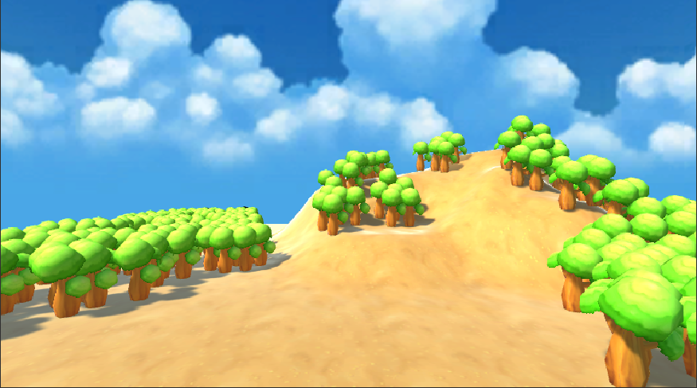
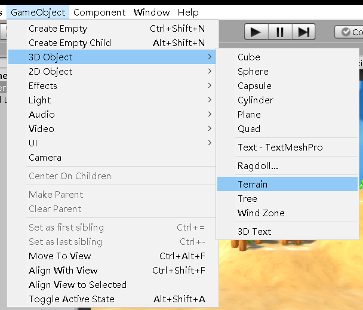
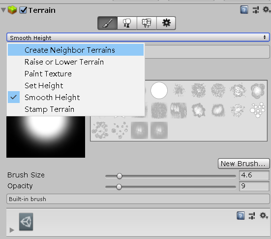
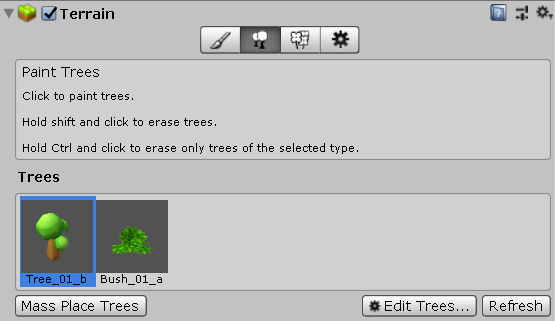
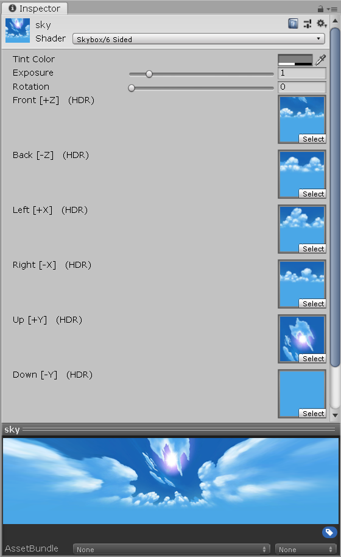

## 第三次作业
### 1、基本操作演练【建议做】

#### 下载 Fantasy Skybox FREE， 构建自己的游戏场景

#### 写一个简单的总结，总结游戏对象的使用

1. 首先需要添加一个GameObject——Terrian

2. 需要在Asset Store中下载一些资源，我下载了Fantasy Skybox FREE

3. 然后在这些地方对这块地进行修容

4. 还可以添加一些树，也可以添加人进去

5. 最后是设置Skybox，需要创建一个Material，并在Inspector的shader设置其为 skybox的6 sided，然后把照片拖进去

6. 最后的最后是要调整一些辅助工具，有如摄像头、阳光等辅助对象。

### 2、编程实践

#### 牧师与魔鬼 动作分离版
* 【2019新要求】：设计一个裁判类，当游戏达到结束条件时，通知场景控制器游戏结束
