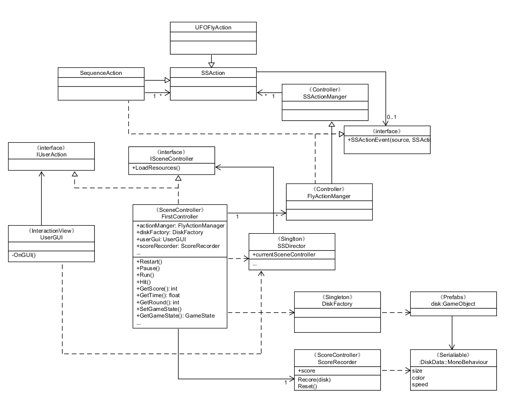
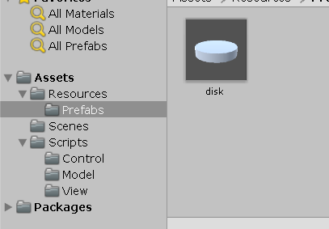

## 第五次作业
### 1、编写一个简单的鼠标打飞碟（Hit UFO）游戏

* 游戏内容要求：
    1. 游戏有 n 个 round，每个 round 都包括10 次 trial；
    2. 每个 trial 的飞碟的色彩、大小、发射位置、速度、角度、同时出现的个数都可能不同。它们由该 round 的 ruler 控制；
    3. 每个 trial 的飞碟有随机性，总体难度随 round 上升；
    4. 鼠标点中得分，得分规则按色彩、大小、速度不同计算，规则可自由设定。
* 游戏的要求：
    * 使用带缓存的工厂模式管理不同飞碟的生产与回收，该工厂必须是场景单实例的！具体实现见参考资源 Singleton 模板类
    * 尽可能使用前面 MVC 结构实现人机交互与游戏模型分离
参考：[弹药和敌人：减少，重用和再利用](http://www.manew.com/thread-48481-1-1.html)

#### 游戏简介：  
该游戏总共有三个回合，每个回合都比上一个回合难度更大，每个回合都是40秒的时间，三个回合结束后游戏结束，获得最终分数。首先是回合一，只有黄色飞碟（普通飞碟，速度正常，奖励1分），这一回合需要达到20分才能晋级到下一回合。然后是回合二，加进了红色飞碟（快速飞碟，速度快，奖励2分），这一回合需要达到50分才能晋级下一回合。最后一个回合，加进了蓝色飞碟（分身飞碟，速度正常，但会同时3个飞碟一起飞到空中，一个飞碟奖励1分，总共3分），这一回合40秒过后游戏结束。同时，还有一个注意点，遗漏了飞碟会扣两分。

#### 实现过程：
在阐述实现过程之前，我先解释一下。此游戏仍然用之前的MVC结构进行实现，所以很多代码重用了之前的游戏的代码，相当于这一整个框架是没有变，变得是一些具体的实现。同时我还增加了一个模块——DiskFactory，用以代替之前的Model模块，因为此次主要的游戏对象只有飞碟，用这个DiskFactory管理不同飞碟的生产与回收，减少了创建与销毁的次数。在这之前，先看一下UML图，可能会更为清晰：



可以看到游戏主要由这几个模块组成，分别为负责与用户交互的用户界面（UserGUI）、负责游戏对象的动作的运动管理师（ActionManager）、负责管理飞碟的生产与回收的飞碟厂（DiskFactory）以及统筹这几个模块的中心管理模块也是这个唯一场景的管理者——Controller模块。下面就来展示每个模块的核心代码。

1. UserGUI  
在这个模块中主要实现与用户的交互，首先需要在游戏的不同状态展示不同的UI组件，所以这里我利用到了action.action.GetGameState()，同时也要向中心控制模块传递某组件被点击的消息以实现与用户的交互。同时该游戏的玩法正是鼠标点击交互，所以当游戏进行中时，点击事件的发生触发Hit()。
```
//UserGUI.cs
using System.Collections;
using System.Collections.Generic;
using UnityEngine;

public class UserGUI : MonoBehaviour
{
    private IUserAction action;
    readonly float roundTime = 40f;

    GUIStyle style;
    GUIStyle buttonStyle;
    GUIStyle pauseStyle;
    GUIStyle resultStyle;

    void Start()
    {
        action = SSDirector.GetInstance().CurrentScenceController as IUserAction;
        style = new GUIStyle();
        style.fontSize = 20;

        buttonStyle = new GUIStyle("button");
        buttonStyle.fontSize = 30;

        pauseStyle = new GUIStyle("button");
        pauseStyle.alignment = TextAnchor.MiddleCenter;
        pauseStyle.fontSize = 15;

        resultStyle = new GUIStyle();
        resultStyle.fontSize = 50;
        resultStyle.alignment = TextAnchor.MiddleCenter;
        resultStyle.normal.textColor = Color.white;
    }

    void OnGUI()
    {
        if (Input.GetButtonDown("Fire1") && action.GetGameState() == GameState.RUNNING)
        {

            Vector3 pos = Input.mousePosition;
            action.Hit(pos);

        }
        if (action.GetGameState() != GameState.START)
        {
            GUI.Label(new Rect(0, 0, 80, 20), "Round " + (action.GetRound() + 1).ToString(), style);
            GUI.Label(new Rect(0, 20, 80, 20), "Time: " + (roundTime - (int)action.GetTime()).ToString(), style);
            GUI.Label(new Rect(0, 40, 80, 20), "Score: " + action.GetScore().ToString(), style);
        }

        if (action.GetGameState() == GameState.START && GUI.Button(new Rect(320, 280, 130, 55), "Start", buttonStyle))
        {
            action.SetGameState(GameState.RUNNING);
        }
        else if (action.GetGameState() == GameState.RUNNING && GUI.Button(new Rect(695, 5, 55, 30), "pause", pauseStyle))
        {
            action.SetGameState(GameState.PAUSE);
            action.Pause();
        }

        else if (action.GetGameState() == GameState.PAUSE && GUI.Button(new Rect(695, 5, 55, 30), "run", pauseStyle))
        {
            action.SetGameState(GameState.RUNNING);
            action.Run();
        }
        else if (action.GetGameState() == GameState.OVER)
        {   
            if (GUI.Button(new Rect(320, 280, 130, 55), "Restart", buttonStyle))
                action.Restart();

            GUI.Label(new Rect(285, 130, 200, 50), "Your score is " + action.GetScore().ToString() + "!", resultStyle);
        }

    }
}

```

2. ActionManager  
动作管理主要要负责飞碟的飞行，以及当导演喊cut时（游戏暂停时）要控制使飞行的动作也暂停。
```
public class FlyActionManager : SSActionManager  //本游戏管理器
{

    private UFOFlyAction fly;     //飞行动作，这次只有单独动作，没有组合动作

    public FirstController sceneController;

    protected void Start()
    {
        sceneController = (FirstController)SSDirector.GetInstance().CurrentScenceController;
        sceneController.actionManager = this;
    }

    public void UFOFly(GameObject disk, float angle)
    {
        fly = UFOFlyAction.GetSSAction(disk.GetComponent<DiskData>().direction, angle, disk.GetComponent<DiskData>().speed);
        this.RunAction(disk, fly, this);
    }

    public void Pause()
    {
        fly.run = false;
    }

    public void Run()
    {
        fly.run = true;
    }

}
```

```
public class UFOFlyAction : SSAction                       
{

    public float gravity = -5;                                 //向下的加速度
    private Vector3 startVector;                              //初速度向量
    private Vector3 gravityVector = Vector3.zero;             //加速度的向量，初始时为0
    private float time;                                        //已经过去的时间
    private Vector3 currentAngle = Vector3.zero;               //当前时间的欧拉角
    public bool run = true;

    private UFOFlyAction() { }
    public static UFOFlyAction GetSSAction(Vector3 direction, float angle, float power)
    {
        //初始化物体将要运动的初速度向量
        UFOFlyAction action = CreateInstance<UFOFlyAction>();
        if (direction.x == -1)
        {
            action.startVector = Quaternion.Euler(new Vector3(0, 0, -angle)) * Vector3.left * power;
        }
        else
        {
            action.startVector = Quaternion.Euler(new Vector3(0, 0, angle)) * Vector3.right * power;
        }
        return action;
    }

    public void Update()
    {
        if (run)
        {
            //斜抛运动
            //计算物体的向下的速度,v=at
            time += Time.fixedDeltaTime;
            gravityVector.y = gravity * time;

            //位移模拟
            transform.position += (startVector + gravityVector) * Time.fixedDeltaTime;
            currentAngle.z = Mathf.Atan((startVector.y + gravityVector.y) / startVector.x) * Mathf.Rad2Deg;
            transform.eulerAngles = currentAngle;

            //如果物体y坐标小于-10，动作就做完了
            if (this.transform.position.y < -10)
            {
                this.destroy = true;
                this.callback.SSActionEvent(this);
            }
        } 
    }
    public void Start() 
    {

    }
}
```

3. DiskFactory  
飞碟工厂主要辅助飞碟的生产和回收，即生产一个飞碟并投入使用时会加入到used队列，当被使用完了进行回收就会加入到free队列，以供下次继续使用而不比重新生产新的飞碟。为了管理飞碟我们需要一个DiskData管理飞碟的数据。
```
using System.Collections;
using System.Collections.Generic;
using UnityEngine;

public class DiskFactory : MonoBehaviour
{
    public GameObject disk;                 //飞碟预制体
    private List<DiskData> used = new List<DiskData>();   //正在被使用的飞碟列表
    private List<DiskData> free = new List<DiskData>();   //空闲的飞碟列表

    public GameObject GetDisk(int round)
    {
        disk = null;
        if (free.Count > 0)
        {
            disk = free[0].gameObject;
            free.Remove(free[0]);
        }
        else
        {
            disk = GameObject.Instantiate<GameObject>(Resources.Load<GameObject>("Prefabs/disk"), Vector3.zero, Quaternion.identity);
            disk.AddComponent<DiskData>(); 
        }
        // round 1: 全是黄色disk，最慢 
        // round 2: 40%可能出现黄色，60%可能出现红色（更快）
        // round 3: 20%可能出现黄色，30%可能出现红色，50%可能出现黑色（更快 or 同时出现？）
        int start = 0;
        int selectedColor = Random.Range(start, round * 500);

        if (selectedColor >= 500)
        {
            round = 2;
        }
        else if (selectedColor >= 200)
        {
            round = 1;
        }
        else
        {
            round = 0;
        }


        switch (round)
        {

            case 0:
                {
                    disk.GetComponent<DiskData>().color = Color.yellow;
                    disk.GetComponent<DiskData>().speed = Random.Range(10f, 12f);
                    float startX = UnityEngine.Random.Range(-1f, 1f) < 0 ? -1 : 1;
                    disk.GetComponent<DiskData>().direction = new Vector3(startX, 1, 0);
                    disk.GetComponent<DiskData>().score = 1;
                    disk.GetComponent<Renderer>().material.color = Color.yellow;
                    break;
                }
            case 1:
                {
                    disk.GetComponent<DiskData>().color = Color.red;
                    disk.GetComponent<DiskData>().speed = Random.Range(15f, 18f);
                    float startX = UnityEngine.Random.Range(-1f, 1f) < 0 ? -1 : 1;
                    disk.GetComponent<DiskData>().direction = new Vector3(startX, 1, 0);
                    disk.GetComponent<DiskData>().score = 2;
                    disk.GetComponent<Renderer>().material.color = Color.red;
                    break;
                }
            case 2:
                {
                    disk.GetComponent<DiskData>().color = Color.blue;
                    disk.GetComponent<DiskData>().speed = Random.Range(10f, 15f);
                    float startX = UnityEngine.Random.Range(-1f, 1f) < 0 ? -1 : 1;
                    disk.GetComponent<DiskData>().direction = new Vector3(startX, 1, 0);
                    disk.GetComponent<DiskData>().score = 3;
                    disk.GetComponent<Renderer>().material.color = Color.blue;
                    break;
                }
        }

        used.Add(disk.GetComponent<DiskData>());
        return disk;
    }

    //回收飞碟
    public void FreeDisk(GameObject disk)
    {
        for (int i = 0; i < used.Count; i++)
        {
            if (disk.GetInstanceID() == used[i].gameObject.GetInstanceID())
            {
                used[i].gameObject.SetActive(false);
                free.Add(used[i]);
                used.Remove(used[i]);
                break;
            }
        }
    }
}
```

4. Controller  
为了简短一点，我删除掉了一些函数的实现，这里场景主要是要根据游戏状态执行相应的任务，也是通过他来统筹多个模块进行工作。Update函数重复调用以使游戏正常进行下去。

```
//FirstController .cs
using System.Collections;
using System.Collections.Generic;
using UnityEngine;

public class FirstController : MonoBehaviour, ISceneController, IUserAction
{
    readonly float roundTime = 40f;
    private float speed = 1.5f;                                                //发射一个飞碟的时间间隔
    readonly int[] passScore = { 20, 50 };

    private List<GameObject> disks = new List<GameObject>();          //飞碟队列
    private int currentRound = 0;                                                   //回合
    private float time = 0f;                                                 //记录时间间隔
    private float currrentTime = 0f;
    private GameState gameState = GameState.START;

    public UserGUI userGUI;
    public ScoreRecorder scoreRecorder;      //计分   
    public DiskFactory diskFactory;          //生成和回收飞碟
    public FlyActionManager actionManager;   //动作管理

    ...

    void Update()
    {
        if (gameState == GameState.RUNNING ) 
        {
            for (int i = 0; i < disks.Count; i++)
            {
                //飞碟飞出摄像机视野也没被打中
                if ((disks[i].transform.position.y <= -4.5) && disks[i].gameObject.activeSelf == true)
                {
                    diskFactory.FreeDisk(disks[i]);
                    disks.Remove(disks[i]);
                    scoreRecorder.Miss();
                }
            }
            if (time > speed)
            {
                time = 0;
                SendDisk();
            }
            else
            {
                time += Time.deltaTime;
            }

            if (currrentTime > roundTime)
            {
                currrentTime = 0;
                if (currentRound < 2 && GetScore() >= passScore[currentRound])
                {
                    currentRound++;
                    time = 0f;
                }
                else
                {
                    GameOver();
                } 
            }
            else
            {
                currrentTime += Time.deltaTime;
            }
        }
    }

    private void GameOver()
    {
        gameState = GameState.OVER;
        currrentTime = 40;
    }

    public void Hit(Vector3 pos)
    {
        Ray ray = Camera.main.ScreenPointToRay(pos);
        RaycastHit[] hits;
        hits = Physics.RaycastAll(ray);
        bool isHit = false;
        for (int i = 0; i < hits.Length; i++)
        {
            RaycastHit hit = hits[i];

            
            if (hit.collider.gameObject.GetComponent<DiskData>() != null)       //射线打中某物体
            {
                for (int j = 0; j < disks.Count; j++)        //射中的物体要在飞碟列表中
                {
                    if (hit.collider.gameObject.GetInstanceID() == disks[j].gameObject.GetInstanceID())
                    {
                        isHit = true;
                    }
                }
                if (!isHit)        //如果没有打中，返回
                {
                    return;
                }

                disks.Remove(hit.collider.gameObject);          //从队列中移除

                scoreRecorder.Record(hit.collider.gameObject);      //记分员记录分数
                
                StartCoroutine(WaitingParticle(0.08f, hit, diskFactory, hit.collider.gameObject));      //等0.08秒后执行回收飞碟，这一步很关键
                break;
            }
        }
    }
    //暂停几秒后回收飞碟
    IEnumerator WaitingParticle(float waitTime, RaycastHit hit, DiskFactory diskFactory, GameObject obj)
    {
        yield return new WaitForSeconds(waitTime);
        //等待之后执行的动作  
        hit.collider.gameObject.transform.position = new Vector3(0, -9, 0);
        diskFactory.FreeDisk(obj);
    }

    //发送飞碟
    private void SendDisk()
    {
        
        GameObject disk = diskFactory.GetDisk(currentRound);
        disks.Add(disk);
        disk.SetActive(true);
        //设置被隐藏了或是新建的飞碟的位置
        float positionX = 16;
        float ranY = Random.Range(1f, 4f);
        float ranX = Random.Range(-1f, 1f) < 0 ? -1 : 1;
        disk.GetComponent<DiskData>().direction = new Vector3(ranX, ranY, 0);
        Vector3 position = new Vector3(-disk.GetComponent<DiskData>().direction.x * positionX, ranY, 0);
        disk.transform.position = position;
        //设置飞碟初始角度
        float angle = Random.Range(15f, 20f);
        actionManager.UFOFly(disk, angle);
        if (disk.GetComponent<DiskData>().color == Color.blue)
        {
            GameObject disk1 = Instantiate(disk);
            GameObject disk2 = Instantiate(disk);
            disks.Add(disk1);
            disk1.SetActive(true);
            disk1.GetComponent<DiskData>().direction = new Vector3(ranX, ranY, 0);
            disk1.transform.position = position;
            actionManager.UFOFly(disk1, Random.Range(15f, 28f));

            disks.Add(disk2);
            disk2.SetActive(true);
            disk2.GetComponent<DiskData>().direction = new Vector3(ranX, ranY, 0);
            disk2.transform.position = position;
            actionManager.UFOFly(disk2, Random.Range(15f, 28f));

        }
    }

    ...
}   

```  

除此之外，还有一个记分员。虽然我把它放置在Model下，但实际它是一个Controller，负责计分以及扣分。
```
using System.Collections;
using System.Collections.Generic;
using UnityEngine;

public class ScoreRecorder : MonoBehaviour
{
    public int score;                   //分数

    void Start()
    {
        score = 0;
    }

    //记录分数
    public void Record(GameObject disk)
    {
        score = disk.GetComponent<DiskData>().score + score;
    }

    public void Miss()
    {
        if (score >= 2)
            score -= 2;
        else
            score = 0;
    }

    //重置分数
    public void Reset()
    {
        score = 0;
    }
}
```

#### 游戏的不足与改进
1. 玩过游戏就会知道，首先一点飞碟由于其形状原因，在有些情况下会比较难点击成功（飞碟飞得快时更是这一），这是很不舒服的用户体验。为了改进这个不足，我建议可以放大游戏对象飞碟的可点击范围，以使飞碟更容易被点击而不受限于飞碟本身的大小
2. 还有就是飞碟的飞行轨迹不科学，有时飞碟会飞到游戏场景外去，玩家无法点击就Miss掉了一个飞碟。当然这个很容易改进，只需控制好飞碟的角度与位置的随机范围即好，当然这个范围使这两个参数相互制约才能控制不飞出界外，这个需要了解好相机的范围以及需要一定的数学计算，这里我就偷懒先不解决这个问题。
3. 更好的用户交互界面，首先界面可以更美以及飞碟可以更酷炫，这些需要个美工与一定的素材；除此之外还有点击效果，点击飞碟之后可以加爆炸效果以及音效，游戏过程中也能加音乐，也可以在游戏界面下方加一个枪并随着光标的方向180度左右旋转等。

### 2、编写一个简单的自定义 Component （选做）

* 用自定义组件定义几种飞碟，做成预制
    * 参考官方脚本手册 https://docs.unity3d.com/ScriptReference/Editor.html
    * 实现自定义组件，编辑并赋予飞碟一些属性

这就是我设计的飞碟，我会在游戏中根据难度调整飞碟的颜色。

