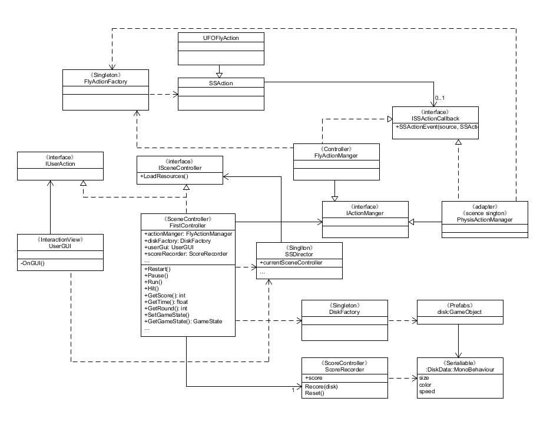
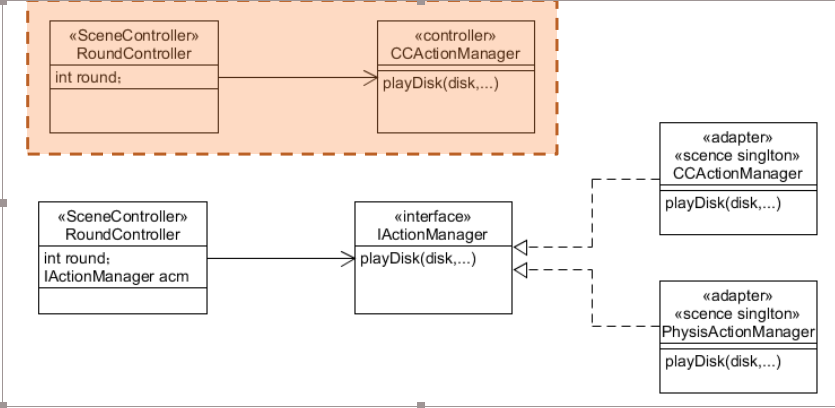

## 第六次作业
### 1、改进飞碟（Hit UFO）游戏：

* 游戏内容要求：
    * 按 adapter模式 设计图修改飞碟游戏
    * 使它同时支持物理运动与运动学（变换）运动

#### UML图及其分析



与原来相比，主要是ActionManager，这次为了使飞碟同时支持物理运动与运动学（变换）运动，所以实现了一个adpater，即通过IActionManager来支持多种动作。



#### 实现adapter模式
实现adapter模式，重点就在于IActionManager，要控制飞碟同时进行物理运动和运动学运动。物理运动则主要是让飞碟具有刚体以及碰撞盒等部件，而运动学运动就是控制飞碟的一些简单的运动，transform的运动，实际上功能有重合。而为了让其同时进行工作，我让他们都继承于UFOFlyAction，不过一个是调用FixedUpdate（物理），一个调用Update。而IActionManager，则是一个接口，规定了动作管理器需要实现哪些功能。接下来展示一些关键代码，完整代码请看(github)[]

IActionManager：这里主要定义游戏需要的最重要的就是飞碟飞行的动作，还有游戏暂停与开始。接下来就可以在PhysicActionManager和FlyActionManager中实现它们。
```
public interface IActionManager
{
    void Pause();
    void Run();
    void StartThrow(GameObject disk);
}
```

PhysicActionManager：这次我直接不用直接继承某个action，而是使用一个ActionFactory来生成各种需要的动作（由于物理动作与运动学动作可以同时实现，所以不需要分多个动作，ActionFactory只生产FlyAction)，物理动作主要调用action的FixedUpdate，这里的实现方式我是参考自优秀博客的，我认为ActionFactory已经能够很好管理动作的生成与复用了，所以可以减少这里一些动作管理，仅仅是对一个动作的生命周期进行管理，需要时就调用，动作做完就通知ActionFactory回收。但由于调用Action又需要用一个队列管理，所以更改也遇到瓶颈。
```
public class PhysicActionManager : MonoBehaviour, IActionManager, ISSActionCallback
{
    public FirstController sceneController;
    public int DiskNumber = 0;


    private Dictionary<int, SSAction> actions = new Dictionary<int, SSAction>();        //保存所以已经注册的动作
    private List<SSAction> waitingAdd = new List<SSAction>();                           //动作的等待队列，在这个对象保存的动作会稍后注册到动作管理器里
    private List<int> waitingDelete = new List<int>();                                  //动作的删除队列，在这个对象保存的动作会稍后删除
    private bool run;

    public void Start()
    {
        sceneController = (FirstController)SSDirector.GetInstance().CurrentScenceController;
        sceneController.actionManager = this;
        run = true;

    }

    public void FixedUpdate()
    {
        if (run)
        {
            foreach (SSAction action in waitingAdd)
            {
                actions[action.GetInstanceID()] = action;
            }
            waitingAdd.Clear();

            foreach (KeyValuePair<int, SSAction> kv in actions)
            {
                SSAction action = kv.Value;
                if (action.destroy)
                {
                    waitingDelete.Add(action.GetInstanceID());
                }
                else if (action.enable)
                {
                    action.FixedUpdate();
                }
            }

            //把删除队列里所有的动作删除
            foreach (int key in waitingDelete)
            {
                SSAction action = actions[key];
                actions.Remove(key);
                DestroyObject(action);
            }
            waitingDelete.Clear();
        }  
    }

    //初始化一个动作
    public void RunAction(GameObject gameobject, SSAction action, ISSActionCallback manager)
    {
        action.gameobject = gameobject;
        action.transform = gameobject.transform;
        action.callback = manager;
        waitingAdd.Add(action);
        action.Start();
    }

    public void SSActionEvent(SSAction source, SSActionEventType events = SSActionEventType.Competeted, int intParam = 0, string strParam = null, Object objectParam = null)
    {
        if (source is UFOFlyAction)
        {
            DiskNumber--;
            source.gameobject.SetActive(false);
        }
    }

    public void StartThrow(GameObject disk)
    {
        FlyActionFactory factory = Singleton<FlyActionFactory>.Instance;
        RunAction(disk, factory.GetSSAction(), (ISSActionCallback)this);
    }

    public void Pause()
    {
        run = false;
    }

    public void Run()
    {
        run = true;
    }
}
```

FlyActionManager：实现方式与PhysicActionManager类似，调用action的Update即可。
```
public class FlyActionManager : MonoBehaviour, ISSActionCallback, IActionManager
{
    public int DiskNumber = 0;
    public FirstController sceneController;

    private Dictionary<int, SSAction> actions = new Dictionary<int, SSAction>();        //保存所以已经注册的动作
    private List<SSAction> waitingAdd = new List<SSAction>();                           //动作的等待队列，在这个对象保存的动作会稍后注册到动作管理器里
    private List<int> waitingDelete = new List<int>();
    private bool run;

    protected void Start()
    {
        sceneController = (FirstController)SSDirector.GetInstance().CurrentScenceController;
        sceneController.actionManager = this;
        run = true;
    }

    protected void Update()
    {
        if (run)
        {
            foreach (SSAction ac in waitingAdd)
            {
                actions[ac.GetInstanceID()] = ac;
            }
            waitingAdd.Clear();

            foreach (KeyValuePair<int, SSAction> kv in actions)
            {
                SSAction action = kv.Value;
                if (action.destroy)
                {
                    waitingDelete.Add(action.GetInstanceID());
                }
                else if (action.enable)
                {
                    action.Update();
                }
            }

            foreach (int key in waitingDelete)
            {
                SSAction action = actions[key];
                actions.Remove(key);
                DestroyObject(action);
            }
            waitingDelete.Clear();
        }    
    }

    public void RunAction(GameObject gameobject, SSAction action, ISSActionCallback manager)
    {
        action.gameobject = gameobject;
        action.transform = gameobject.transform;
        action.callback = manager;
        waitingAdd.Add(action);
        action.Start();
    }

    public void SSActionEvent(SSAction source, SSActionEventType events = SSActionEventType.Competeted, int intParam = 0, string strParam = null, Object objectParam = null)
    {
        if (source is UFOFlyAction)
        {
            DiskNumber--;
            source.gameobject.SetActive(false);
        }
    }

    public void StartThrow(GameObject disk)
    {
        FlyActionFactory cf = Singleton<FlyActionFactory>.Instance;
        RunAction(disk, cf.GetSSAction(), (ISSActionCallback)this);
    }

    public void Pause()
    {
        run = false;
    }

    public void Run()
    {
        run = true;
    }
}
```

FlyActionFactory：具体的实现与DiskFactory类似，维护一个used队列和free队列就能实现工厂模式的不浪费。这是我在上次中没有想到的，参考自优秀博客。
```
public class FlyActionFactory : MonoBehaviour
{
    private Dictionary<int, SSAction> used = new Dictionary<int, SSAction>();
    private List<SSAction> free = new List<SSAction>();
    private List<int> wait = new List<int>();

    public UFOFlyAction Fly;

    void Start()
    {
        Fly = UFOFlyAction.GetCCFlyAction();
    }

    //每此刷新对判定为destroy的动作进行释放
    private void Update()
    {
        foreach (var action in used.Values)
        {
            if (action.destroy)
            {
                wait.Add(action.GetInstanceID());
            }
        }

        foreach (int ID in wait)
        {
            FreeSSAction(used[ID]);
        }
        wait.Clear();
    }
    //获得一个新的动作，先从free队列中找，空则生成一个
    public SSAction GetSSAction()
    {
        SSAction action = null;
        if (free.Count > 0)
        {
            action = free[0];
            free.Remove(free[0]);
            //Debug.Log(free.Count);
        }
        else
        {
            action = ScriptableObject.Instantiate<UFOFlyAction>(Fly);

        }

        used.Add(action.GetInstanceID(), action);
        return action;
    }
    //释放某个动作，加入到free队列
    public void FreeSSAction(SSAction action)
    {
        SSAction tmp = null;
        int key = action.GetInstanceID();
        //检查是否含有某动作
        if (used.ContainsKey(key))
        {
            tmp = used[key];
        }
        //有则释放
        if (tmp != null)
        {
            tmp.Reset();
            free.Add(tmp);
            used.Remove(key);
        }
    }
    //清除所有在使用的动作
    public void clear()
    {
        foreach (var action in used.Values)
        {
            action.enable = false;
            action.destroy = true;

        }
    }
}
```

#### 游戏的不足与改进

#### 游戏展示
