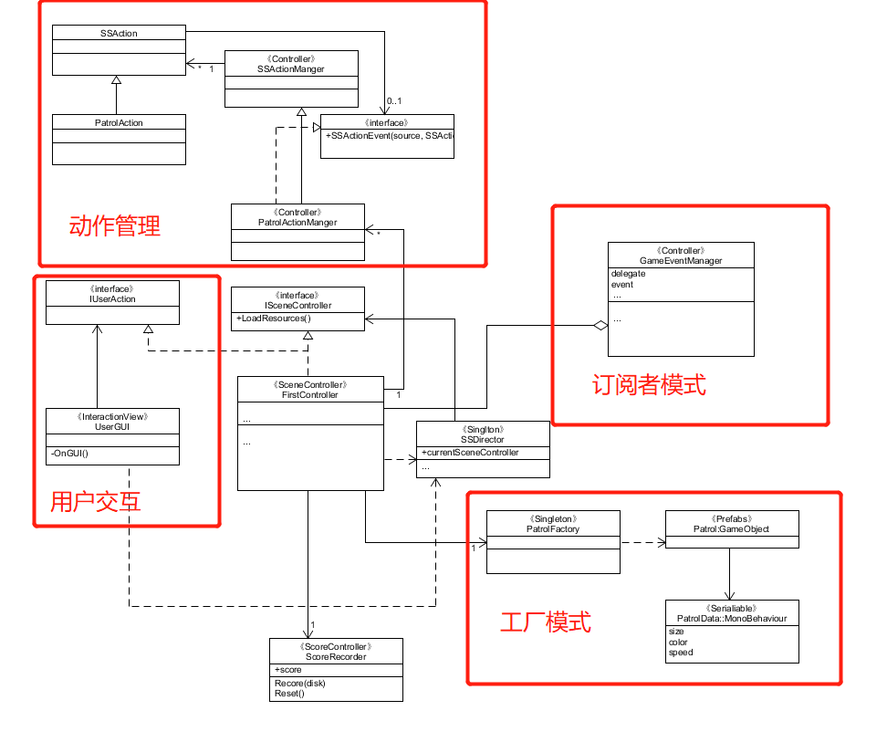

## 第七次作业
### 1、智能巡逻兵

* 提交要求：
* 游戏设计要求：
    * 创建一个地图和若干巡逻兵(使用动画)；
    * 每个巡逻兵走一个3~5个边的凸多边型，位置数据是相对地址。即每次确定下一个目标位置，用自己当前位置为原点计算；
    * 巡逻兵碰撞到障碍物，则会自动选下一个点为目标；
    * 巡逻兵在设定范围内感知到玩家，会自动追击玩家；
    * 失去玩家目标后，继续巡逻；
    * 计分：玩家每次甩掉一个巡逻兵计一分，与巡逻兵碰撞游戏结束；
* 程序设计要求：
    * 必须使用订阅与发布模式传消息
        * subject：OnLostGoal
        * Publisher: ?
        * Subscriber: ?
    * 工厂模式生产巡逻兵
* 友善提示1：生成 3~5个边的凸多边型
    * 随机生成矩形
    * 在矩形每个边上随机找点，可得到 3 - 4 的凸多边型
    * 5 ?
* 友善提示2：参考以前博客，给出自己新玩法

#### 简介
该游戏是一个逃离巡逻者的游戏，游戏通过控制方向键或WASD四个键来控制人物的上左下右。游戏有四个地区，每个地区都有一个zombie进行巡逻，玩家需要避开zombie，避开一次获得一分，被捕捉到则游戏结束。
#### UML图


#### 实现过程
实际上，本次游戏设计使用的框架与之前的游戏都是类似的，本次游戏也使用到了一个新学习的设计模式——发布与订阅模式，主要用于处理事件。

**订阅者与发布者模式：**
订阅者与发布者模式主要用于处理一些事件，如本游戏中的碰撞事件，以及玩家逃脱追捕这些事件。而场景管理器就是这些事件发生的订阅者，而例如碰撞器等就是一些事件发布者，而我们定义一个EventManager来定义一些代理和订阅主题。

GameEventManager：定义了可订阅的主题（事件）。
```
public class GameEventManager : MonoBehaviour
{
    //分数变化
    public delegate void ScoreEvent();
    public static event ScoreEvent ScoreChange;
    //游戏结束变化
    public delegate void GameoverEvent();
    public static event GameoverEvent GameoverChange;

    //玩家逃脱
    public void Escape()
    {
        if (ScoreChange != null)
        {
            ScoreChange();  //玩家逃脱则加一分
        }
    }
    //玩家被捕
    public void Gameover()
    {
        if (GameoverChange != null)
        {
            GameoverChange();   //玩家被捕即游戏结束
        }
    }
}
```

事件发布：首先是碰撞事件，所以要为巡逻者添加碰撞器；然后玩家逃脱事件的发生在动作管理器中发布。
```
public class PlayerCollide : MonoBehaviour
{
    void OnCollisionEnter(Collision other)
    {
        //当玩家与巡逻兵相撞
        if (other.gameObject.tag == "Player")
        {
            //游戏结束，发布消息
            Singleton<GameEventManager>.Instance.Gameover();
        }
    }
}
```
```
//SSActionManager.cs

    ... 

    public void SSActionEvent(SSAction source, int intParam = 0, GameObject objectParam = null)
    {
        if (intParam == 0)
        {
            //侦查兵跟随玩家

            FollowAction follow = FollowAction.GetSSAction(objectParam.gameObject.GetComponent<PatrolData>().player);
            this.RunAction(objectParam, follow, this);
        }
        else
        {
            //侦察兵按照初始位置开始继续巡逻
            PatrolAction move = PatrolAction.GetSSAction(objectParam.gameObject.GetComponent<PatrolData>().startPosition);
            this.RunAction(objectParam, move, this);
            //玩家逃脱
            Singleton<GameEventManager>.Instance.Escape();
        }
    }

    ...

```

订阅者处理：场景管理器订阅了主题，在这里他将会给事件管理器一个为每个订阅主题事件处理函数。
```
//FirstController.cs

    ...

    //订阅者模式
    void OnEnable()
    {
        GameEventManager.ScoreChange += AddScore;
        GameEventManager.GameoverChange += Gameover;
    }


    void OnDisable()
    {
        GameEventManager.ScoreChange -= AddScore;
        GameEventManager.GameoverChange -= Gameover;
    }

    private void AddScore()
    {
        scoreRecorder.Add();
    }

    private void Gameover()
    {
        this.gameState = GameState.OVER;
        player.GetComponent<Animator>().enabled = false;
        for (int i = 0; i < patrols.Count; i++)
        {
            patrols[i].GetComponent<Animator>().enabled = false;
        }
        actionManager.DestroyAll();
    }

    ...

```

**动作管理器：**
SSAction：所有动作的父类。
```
public class SSAction : ScriptableObject            //动作
{

    public bool enable = true;                      //是否正在进行此动作
    public bool destroy = false;                    //是否需要被销毁

    public GameObject gameobject;                   //动作对象
    public Transform transform;                     //动作对象的transform
    public ISSActionCallback callback;              //回调函数

    protected SSAction() { }                        //保证SSAction不会被new

    //子类可以使用下面的函数
    public virtual void Start()                    
    {
        throw new System.NotImplementedException();
    }

    public virtual void Update()
    {
        throw new System.NotImplementedException();
    }

    public void Reset()
    {
        enable = false;
        destroy = false;
        gameobject = null;
        transform = null;
        callback = null;
    }
}
```

SSActionManager：动作管理器的具体实现，实现了巡逻者巡逻与追踪的动作切换。
public class SSActionManager : MonoBehaviour, ISSActionCallback
{
    private Dictionary<int, SSAction> actions = new Dictionary<int, SSAction>();    //将执行的动作的字典集合
    private List<SSAction> waitingAdd = new List<SSAction>();                       //等待去执行的动作列表
    private List<int> waitingDelete = new List<int>();                              //等待删除的动作的key                

    protected void Update()
    {
        foreach (SSAction ac in waitingAdd)
        {
            actions[ac.GetInstanceID()] = ac;
        }
        waitingAdd.Clear();

        foreach (KeyValuePair<int, SSAction> kv in actions)
        {
            SSAction ac = kv.Value;
            if (ac.destroy)
            {
                waitingDelete.Add(ac.GetInstanceID());
            }
            else if (ac.enable)
            {
                //运动学运动更新
                ac.Update();
            }
        }

        foreach (int key in waitingDelete)
        {
            SSAction ac = actions[key];
            actions.Remove(key);
            Destroy(ac);
        }
        waitingDelete.Clear();
    }

    public void RunAction(GameObject gameobject, SSAction action, ISSActionCallback manager)
    {
        action.gameobject = gameobject;
        action.transform = gameobject.transform;
        action.callback = manager;
        waitingAdd.Add(action);
        action.Start();
    }

    public void SSActionEvent(SSAction source, int intParam = 0, GameObject objectParam = null)
    {
        if (intParam == 0)
        {
            //侦查兵跟随玩家

            FollowAction follow = FollowAction.GetSSAction(objectParam.gameObject.GetComponent<PatrolData>().player);
            this.RunAction(objectParam, follow, this);
        }
        else
        {
            //侦察兵按照初始位置开始继续巡逻
            PatrolAction move = PatrolAction.GetSSAction(objectParam.gameObject.GetComponent<PatrolData>().startPosition);
            this.RunAction(objectParam, move, this);
            //玩家逃脱
            Singleton<GameEventManager>.Instance.Escape();
        }
    }


    public void DestroyAll()
    {
        foreach (KeyValuePair<int, SSAction> kv in actions)
        {
            SSAction ac = kv.Value;
            ac.destroy = true;
        }
    }
}

ISSActionCallback：一个interface，实现这个interface的都要实现SSActionEvent函数，应用回调可以实现一些动作切换的工作
```
public enum SSActionEventType : int { Started, Competeted }

public interface ISSActionCallback
{
    void SSActionEvent(SSAction source, int intParam = 0, GameObject objectParam = null);
}

```

PatrolActionManager：场景控制器调用动作管理器的接口
```
public class PatrolActionManager : SSActionManager
{
    //外界调用的动作
    private PatrolAction patrolAction;                            //巡逻兵巡逻

    //外界调用动作的接口
    public void Patrol(GameObject patrol)
    {
        patrolAction = PatrolAction.GetSSAction(patrol.transform.position);
        this.RunAction(patrol, patrolAction, this);
    }


    //停止所有动作
    public void DestroyAllAction()
    {
        DestroyAll();
    }
}
```

PatrolAction：巡逻动作。
```
public class PatrolAction : SSAction
{
    private enum Dirction { EAST, NORTH, WEST, SOUTH };
    private float posX, posZ;                 //移动前的初始x和z方向坐标
    private float moveLength;                  //移动的长度
    private float moveSpeed = 1.2f;            //移动速度
    private bool moveSign = true;              //是否到达目的地
    private Dirction dirction = Dirction.WEST;  //移动的方向
    private PatrolData data;                    //侦察兵的数据


    private PatrolAction() { }                      

    public static PatrolAction GetSSAction(Vector3 location)
    {
        PatrolAction action = CreateInstance<PatrolAction>();
        action.posX = location.x;
        action.posZ = location.z;

        //设定移动矩形的边长
        action.moveLength = Random.Range(3, 3);
        return action;
    }

    public override void Start()
    {
        this.gameobject.GetComponent<Animator>().enabled = true;
        data = this.gameobject.GetComponent<PatrolData>();
    }

    public override void Update()
    {
        //防止碰撞发生后的旋转
        if (transform.localEulerAngles.x != 0 || transform.localEulerAngles.z != 0)
        {
            transform.localEulerAngles = new Vector3(0, transform.localEulerAngles.y, 0);
        }
        if (transform.position.y != 0)
        {
            transform.position = new Vector3(transform.position.x, 0, transform.position.z);
        }

        //如果侦察兵需要跟随玩家并且玩家就在侦察兵所在的区域，侦查动作结束
        if (data.wallSign == data.sign)    //由事件触发
        {
            this.destroy = true;
            this.enable = false;
            this.callback.SSActionEvent(this, 0, this.gameobject);
        }
        else
        {
            Patrol();
        }
    }
    

    private void Patrol()
    {
        if (moveSign)
        {
            //不需要转向则设定一个目的地，按照矩形移动
            switch (dirction)
            {
                case Dirction.EAST:
                    posX -= moveLength;
                    break;
                case Dirction.NORTH:
                    posZ += moveLength;
                    break;
                case Dirction.WEST:
                    posX += moveLength;
                    break;
                case Dirction.SOUTH:
                    posZ -= moveLength;
                    break;
            }
            moveSign = false;
        }
        this.transform.LookAt(new Vector3(posX, 0, posZ));
        float distance = Vector3.Distance(transform.position, new Vector3(posX, 0, posZ));

        //当前位置与目的地距离浮点数的比较决定是否转向
        if (distance > 0.9)
        {
            transform.position = Vector3.MoveTowards(this.transform.position, new Vector3(posX, 0, posZ), moveSpeed * Time.deltaTime);
        }
        else
        {
            dirction = dirction + 1;
            if (dirction > Dirction.SOUTH)
            {
                dirction = Dirction.EAST;
            }
            moveSign = true;
        }
    }
}

```

FollowAction：追踪动作。
```
public class FollowAction : SSAction
{
    private float speed = 2f;            //跟随玩家的速度
    private GameObject player;           //玩家
    private PatrolData data;             //侦查兵数据

    private FollowAction() { }
    public static FollowAction GetSSAction(GameObject player)
    {
        FollowAction action = CreateInstance<FollowAction>();
        action.player = player;
        return action;
    }

    public override void Update()
    {
        //防止碰撞发生后的旋转
        if (transform.localEulerAngles.x != 0 || transform.localEulerAngles.z != 0)
        {
            transform.localEulerAngles = new Vector3(0, transform.localEulerAngles.y, 0);
        }
        if (transform.position.y != 0)
        {
            transform.position = new Vector3(transform.position.x, 0, transform.position.z);
        }

        Follow();

        //如果侦察兵没有跟随对象，或者需要跟随的玩家不在侦查兵的区域内
        if (data.wallSign != data.sign)
        {
            this.destroy = true;
            this.enable = false;
            this.callback.SSActionEvent(this, 1, this.gameobject);
        }
    }
    public override void Start()
    {
        data = this.gameobject.GetComponent<PatrolData>();
    }
    void Follow()
    {
        this.transform.position = Vector3.MoveTowards(this.transform.position, player.transform.position, speed * Time.deltaTime);
        this.transform.LookAt(player.transform.position);
    }
}
```

**工厂模式：**
Singleton<T>：单例模式，工厂模式中的工厂就用单例模式让场景管理器实现，不止它，很多场景管理器需要用到的部件都可以使用单例模式来完成。类似的，导演类也是单例模式的。
```
public class Singleton<T> : MonoBehaviour where T : MonoBehaviour
{
    protected static T instance;

    public static T Instance
    {
        get
        {
            if (instance == null)
            {
                instance = (T)FindObjectOfType(typeof(T));
                if (instance == null)
                {
                    Debug.LogError("An instance of " + typeof(T)
                        + " is needed in the scene, but there is none.");
                }
            }
            return instance;
        }
    }
}
```

PatrolFactory：生产巡逻兵的工厂。
```
public class PatrolFactory : MonoBehaviour
{
    private GameObject patrol = null;                              //巡逻兵
    private List<GameObject> used = new List<GameObject>();        //正在被使用的巡逻兵，该游戏巡逻兵不需要回收，所以不需要free表
    private Vector3[] position = new Vector3[9];                   //保存每个巡逻兵的初始位置

    public FirstController sceneControler;                         //场景控制器

    public List<GameObject> GetPatrols()
    {
        int[] pos_x = { 1, -4};
        int[] pos_z = { 4, -1};
        int index = 0;
        //生成不同的巡逻兵初始位置
        for (int i = 0; i < 2; i++)
        {
            for (int j = 0; j < 2; j++)
            {
                position[index] = new Vector3(pos_x[i], 0, pos_z[j]);
                index++;
            }
        }
        for (int i = 0; i < 4; i++)
        {
            patrol = Instantiate(Resources.Load<GameObject>("Prefabs/zombie"));
            patrol.transform.position = position[i];
            patrol.AddComponent<PatrolData>();
            patrol.GetComponent<PatrolData>().sign = i + 1;
            patrol.GetComponent<PatrolData>().startPosition = position[i];
            used.Add(patrol);
        }
        return used;
    }

    public void StopPatrol()
    {
        //切换所有侦查兵的动画
        for (int i = 0; i < used.Count; i++)
        {
            used[i].gameObject.GetComponent<Animator>().SetBool("run", false);
        }
    }
}
```

PatrolData：为巡逻兵扩展的属性，以更方便游戏逻辑设计，以component的方式附在巡逻兵上
```
public class PatrolData : MonoBehaviour
{
    public int sign;                      //标志巡逻兵在哪一块区域
    public int wallSign = -1;            //当前玩家所在区域标志
    public GameObject player;             //玩家游戏对象,用于跟随
    public Vector3 startPosition;        //当前巡逻兵初始位置    
}
```

**用户图形界面与交互：**
IUserAction：定义的一个接口，这个接口定义了用户可以使用的接口函数，这些函数在场景控制器实现。在UserGUI中则通过与用户交互调用这些函数，真正实现用户交互。
```
public enum GameState { START, RUNNING, OVER, PAUSE }

public interface IUserAction
{
    void MovePlayer(float translationX, float translationZ);
    void Restart();
    GameState GetGameState();
    int GetScore();
    void SetGameState(GameState gameState);
    void GameStart();
}
```

UserGUI：不仅要实现图形界面，还要获取用户的动作事件。
```
public class UserGUI : MonoBehaviour
{
    private IUserAction action;

    GUIStyle labelStyle;
    GUIStyle buttonStyle;
    GUIStyle pauseStyle;
    GUIStyle resultStyle;

    void Start()
    {
        action = SSDirector.GetInstance().CurrentScenceController as IUserAction;

        labelStyle = new GUIStyle();
        labelStyle.fontSize = 20;

        buttonStyle = new GUIStyle("button");
        buttonStyle.fontSize = 30;

        resultStyle = new GUIStyle();
        resultStyle.fontSize = 50;
        resultStyle.alignment = TextAnchor.MiddleCenter;
        resultStyle.normal.textColor = Color.white;
    }

    void Update()
    {
        //获取方向键的偏移量
        float translationX = Input.GetAxis("Horizontal");
        float translationZ = Input.GetAxis("Vertical");
        //移动玩家
        if (action.GetGameState() == GameState.RUNNING)
            action.MovePlayer(translationX, translationZ);
    }

    private void OnGUI()
    {
        if (action.GetGameState() != GameState.START)
        {
            GUI.Label(new Rect(20, 40, 80, 20), "Score: " + action.GetScore().ToString(), labelStyle);
        }

        if (action.GetGameState() == GameState.START && GUI.Button(new Rect(320, 280, 130, 55), "Start", buttonStyle))
        {
            action.SetGameState(GameState.RUNNING);
            action.GameStart();
        }

        if (action.GetGameState() == GameState.OVER)
        {
            if (GUI.Button(new Rect(320, 280, 130, 55), "Restart", buttonStyle))
                action.Restart();

            GUI.Label(new Rect(285, 130, 200, 50), "Your score is " + action.GetScore().ToString() + "!", resultStyle);
        }
    }
}

```

**主场景管理器：**
SSDirector：单例模式的导演类。
```
public class SSDirector : System.Object
{
    //singlton instance
    private static SSDirector _instance;

    public ISceneController CurrentScenceController { get; set; }

    //get instance
    public static SSDirector GetInstance()
    {
        if (_instance == null)
        {
            _instance = new SSDirector();
        }
        return _instance;
    }
}
```

ISceneController：每个场景控制器都要实现的接口。
```
public interface ISceneController
{
    void LoadResources();
}
```

FirstController：该游戏只有这个唯一的场景，所以这个就是这个游戏的最高管理者，用以控制游戏的正常运行。
```
public class FirstController : MonoBehaviour, IUserAction, ISceneController
{
    public PatrolFactory patrolFactory;                               //巡逻者工厂
    public ScoreRecorder scoreRecorder;                               //记分员
    public PatrolActionManager actionManager;                         //动作管理器
    public UserGUI userGUI;                                           //用户图形界面
    public GameObject player;                                         //玩家
    public List<GameObject> patrols;                                  //巡逻兵队列

    private GameState gameState;                                      //游戏状态
    private readonly float playerSpeed = 5;                           //玩家移动速度

    void Start()
    {
        SSDirector director = SSDirector.GetInstance();
        director.CurrentScenceController = this;
        patrolFactory = Singleton<PatrolFactory>.Instance;
        actionManager = gameObject.AddComponent<PatrolActionManager>() as PatrolActionManager;
        userGUI = gameObject.AddComponent<UserGUI>() as UserGUI;
        LoadResources();
        scoreRecorder = Singleton<ScoreRecorder>.Instance;
    }

    void Update()
    {
        int wallSign = 0;
        if (player.transform.position.x < -1 && player.transform.position.z > 1)
            wallSign = 3;
        if (player.transform.position.x > 1 && player.transform.position.z > 1)
            wallSign = 1;
        if (player.transform.position.x < -1 && player.transform.position.z < -1)
            wallSign = 4;
        if (player.transform.position.x > 1 && player.transform.position.z < -1)
            wallSign = 2;

        for (int i = 0; i < patrols.Count; i++)
        {
            patrols[i].gameObject.GetComponent<PatrolData>().wallSign = wallSign;
        }
        if (wallSign != 0)
            patrols[wallSign - 1].gameObject.GetComponent<PatrolData>().player = player;
    }

    public void LoadResources()
    {
        Instantiate(Resources.Load<GameObject>("Prefabs/Plane"));
        player = Instantiate(Resources.Load("Prefabs/player"), new Vector3(0, 0, -4), Quaternion.identity) as GameObject;
        player.GetComponent<Animator>().enabled = false;
        patrols = patrolFactory.GetPatrols();

        
        for (int i = 0; i < patrols.Count; i++)
        {
            patrols[i].GetComponent<Animator>().enabled = false;
        }        
    }

    //用户接口
    public void MovePlayer(float translationX, float translationZ)
    {
        //实际上移动玩家这个任务应该交给动作管理器完成，这里由于玩家动作简单，所以为了简化代码，就交给场景管理器代劳
        if (translationX != 0 || translationZ != 0)
        {
            player.GetComponent<Animator>().enabled = true;

            if (translationZ > 0)
            {
                player.transform.localEulerAngles = new Vector3(0, 0, 0);
                player.transform.Translate(0, 0, translationZ * playerSpeed * Time.deltaTime);
            }
            if (translationZ < 0)
            {
                player.transform.localEulerAngles = new Vector3(0, 180, 0);
                player.transform.Translate(0, 0, -translationZ * playerSpeed * Time.deltaTime);
            }
            if (translationX > 0.45)
            {
                player.transform.localEulerAngles = new Vector3(0, 90, 0);
                player.transform.Translate(0, 0, translationX * playerSpeed * Time.deltaTime);
            }
            if (translationX < -0.45)
            {
                player.transform.localEulerAngles = new Vector3(0, -90, 0);
                player.transform.Translate(0, 0, -translationX * playerSpeed * Time.deltaTime);
            }         
        }
        else
        {
            player.GetComponent<Animator>().enabled = false;
            player.transform.localEulerAngles = new Vector3(0, player.transform.localEulerAngles.y, 0);
        }

        //防止碰撞带来的移动
        if (player.transform.localEulerAngles.x != 0 || player.transform.localEulerAngles.z != 0)
        {
            player.transform.localEulerAngles = new Vector3(0, player.transform.localEulerAngles.y, 0);
        }
        if (player.transform.position.y != 0)
        {
            player.transform.position = new Vector3(player.transform.position.x, 0, player.transform.position.z);
        }
    }

    public void GameStart()
    {
        for (int i = 0; i < patrols.Count; i++)
        {
            actionManager.Patrol(patrols[i]);
            patrols[i].GetComponent<Animator>().enabled = true;
        }
    }

    public void Restart()
    {
        gameState = GameState.RUNNING;
        scoreRecorder.Reset();
        player.transform.position = new Vector3(0, 0, -4);
        player.transform.localEulerAngles = new Vector3(0, 0, 0);

        int[] pos_x = { 1, -4 };
        int[] pos_z = { 4, -1 };
        Vector3[] position = new Vector3[9];
        int index = 0;
        //生成不同的巡逻兵初始位置
        for (int i = 0; i < 2; i++)
        {
            for (int j = 0; j < 2; j++)
            {
                position[index] = new Vector3(pos_x[i], 0, pos_z[j]);
                index++;
            }
        }
        for (int i = 0; i < patrols.Count; i++)
        {
            patrols[i].transform.position = position[i]; 
        }
        

        GameStart();
    }

    //订阅者模式
    void OnEnable()
    {
        GameEventManager.ScoreChange += AddScore;
        GameEventManager.GameoverChange += Gameover;
    }


    void OnDisable()
    {
        GameEventManager.ScoreChange -= AddScore;
        GameEventManager.GameoverChange -= Gameover;
    }

    private void AddScore()
    {
        scoreRecorder.Add();
    }

    private void Gameover()
    {
        this.gameState = GameState.OVER;
        player.GetComponent<Animator>().enabled = false;
        for (int i = 0; i < patrols.Count; i++)
        {
            patrols[i].GetComponent<Animator>().enabled = false;
        }
        actionManager.DestroyAll();
    }

    public GameState GetGameState()
    {
        return gameState;
    }

    public int GetScore()
    {
        return scoreRecorder.score;
    }

    public void SetGameState(GameState gameState)
    {
        this.gameState = gameState;
    }

}
```

**其它：**
ScoreRecorder：负责计分，通过单例模式被场景控制器调用。
```
public class ScoreRecorder : MonoBehaviour
{
    public int score;                   //分数

    void Start()
    {
        score = 0;
    }

    //记录分数
    public void Add()
    {
        score++;
    }

    //重置分数
    public void Reset()
    {
        score = 0;
    }
}
```

#### 游戏的不足与改进
该游戏作为作业我仅仅是为了学习设计模式而进行的，所以当然有很多地不足与改进空间。希望未来有空的时候能增加一些新的游戏功能，当然增加了复杂的游戏功能的同时，游戏中一些设计模式需要改进，因为本次游戏没那么复杂，所以没有严格遵守设计模式。所以实际上当对游戏扩展时，游戏的分工需要更明确，尽量降低各个模块间的耦合性。

#### 游戏展示
[Patrol](https://v.youku.com/v_show/id_XNDQxNDkxMjc1Ng==.html?spm=a2h0j.11185381.listitem_page1.5~A)
