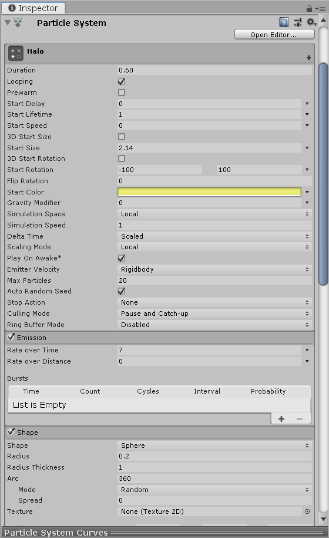
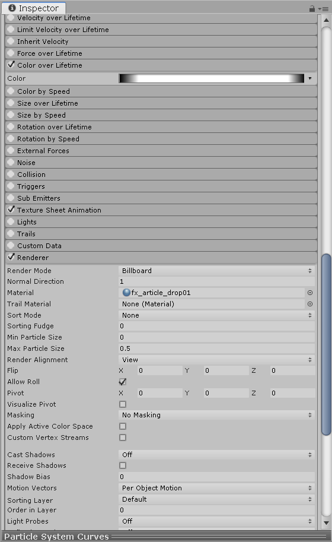
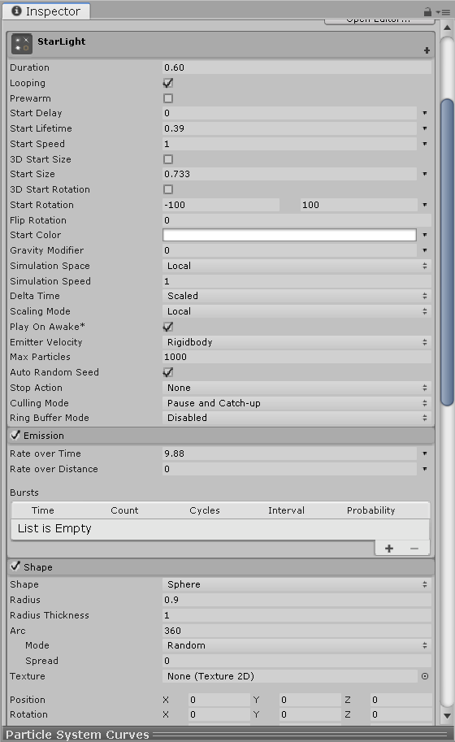
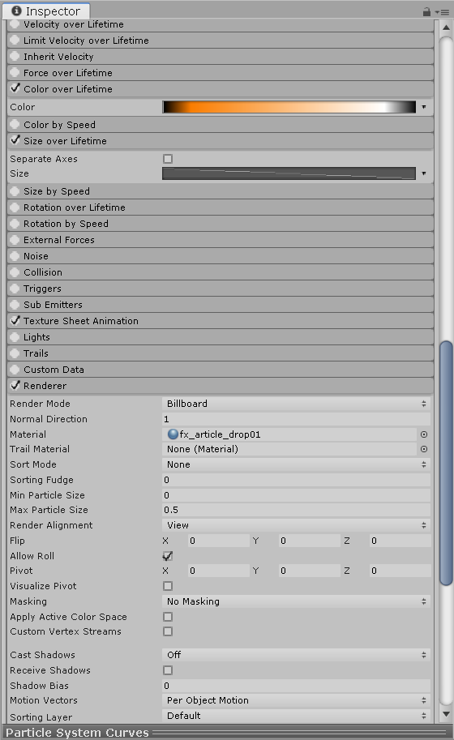
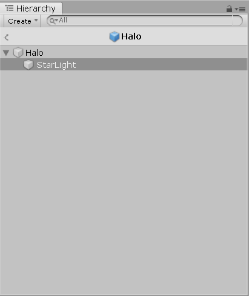
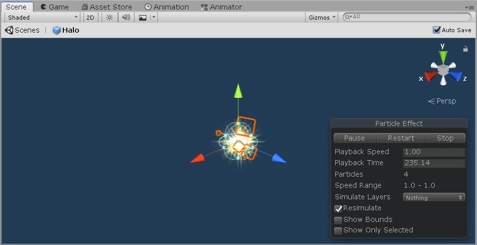
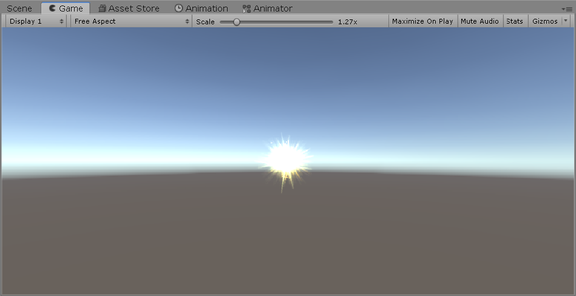
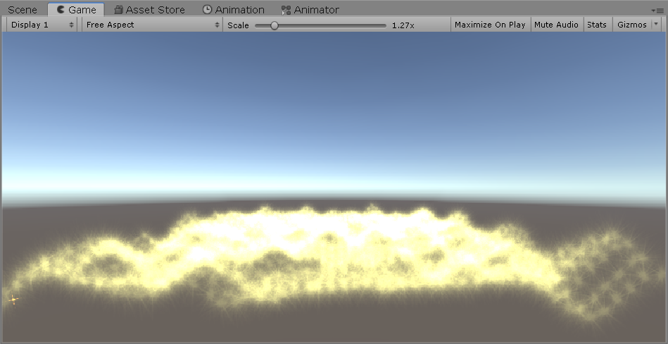

## 第八次作业

本次作业基本要求是三选一，我选择了简单粒子制作

1、简单粒子制作

* 按参考资源要求，制作一个粒子系统，参考资源
* 使用 3.3 节介绍，用代码控制使之在不同场景下效果不一样

### 实现过程
#### 粒子制作
这一步是按照[参考资源](https://www.cnblogs.com/CaomaoUnity3d/p/5983730.html)进行的，而且课堂上也学习了粒子的制作，所以就比较简单。

这次的粒子，不只有一个Particle System，而是有光晕和星光两种Particle System结合。

1. 首先，是光晕的制作，先新建一个Particle System，然后设置如下：  




2. 接着是星光的制作，也新建一个Particle System，然后设置如下：  




3. 最后将星光加入到光晕为其子游戏对象，并保存为预制。




#### 代码控制
我的想法是是一个简单的变换，初始时游戏画面中间会有一个发光粒子，然后点击它一下会自动下降然后变化为一片星海。

那么代码怎么实现呢？分为两个部分，一个是星海的实现代码，一个是与用户交互并控制粒子变化的代码。

**ParticleSea：实现星海**  
按照课堂上的教程，使用柏林噪声模拟星海。
```
public class ParticleSea : MonoBehaviour
{
    public ParticleSystem particleSystem;
    private ParticleSystem.Particle[] particlesArray;

    public int seaResolution = 50;
    public float spacing = 0.5f;

    public float noiseScale = 0.2f;
    public float heightScale = 3f;

    private float perlinNoiseAnimX = 0.01f;
    private float perlinNoiseAnimY = 0.01f;

    // Start is called before the first frame update
    void Start()
    {
        particleSystem = ParticleSystem.Instantiate<ParticleSystem>(Resources.Load<ParticleSystem>("Prefabs/Halo"));
        particlesArray = new ParticleSystem.Particle[seaResolution * seaResolution];
        particleSystem.maxParticles = seaResolution * seaResolution;
        particleSystem.Emit(seaResolution * seaResolution);
        particleSystem.GetParticles(particlesArray);
    }

    // Update is called once per frame
    void Update()
    {
        for (int i = 0; i < seaResolution; i++)
        {
            for (int j = 0; j < seaResolution; j++)
            {
                float zPos = Mathf.PerlinNoise(i * noiseScale + perlinNoiseAnimX, j * noiseScale + perlinNoiseAnimY) * heightScale;
                particlesArray[i * seaResolution + j].position = new Vector3(i * spacing, zPos, j * spacing);
            }
        }

        perlinNoiseAnimX += 0.01f;
        perlinNoiseAnimY += 0.01f;

        particleSystem.SetParticles(particlesArray, particlesArray.Length);
    }
}
```

**ClickHandle：用户交互与控制**  
为粒子设置一个碰撞器，当点击粒子时，会将粒子变化为一片星海，在Update中实现。
```
public class ClickHandle : MonoBehaviour
{
    public GameObject paricle;

    private int speed = 0;

    // Start is called before the first frame update
    void Start()
    {
        speed = 0;
        paricle = ParticleSystem.Instantiate<GameObject>(Resources.Load<GameObject>("Prefabs/SimpleParticle"));
    }

    // Update is called once per frame
    void Update()
    {
        if (paricle != null && paricle.transform.position.y > -3)
        {
            paricle.transform.Translate(new Vector3(0, -2, 0) * speed * Time.deltaTime);
        }
        else if (paricle != null && paricle.GetComponent<ParticleSea>() == null)
        {
            Destroy(paricle);
            this.gameObject.AddComponent<ParticleSea>();
        }
            

        if (Input.GetButtonDown("Fire1"))
        {
            Ray ray = Camera.main.ScreenPointToRay(Input.mousePosition);
            RaycastHit[] hits;
            hits = Physics.RaycastAll(ray);

            for (int i = 0; i < hits.Length; i++)
            {
                RaycastHit hit = hits[i];


                if (hit.collider.gameObject != null)       //射线打中某物体
                {
                    speed = 2;
                }
            }
        }   
    }
}
```

### 结果展示
图片：  




完整视频：[https://v.youku.com/v_show/id_XNDQyNDA2OTUyMA==.html?spm=a2hzp.8244740.0.0](https://v.youku.com/v_show/id_XNDQyNDA2OTUyMA==.html?spm=a2hzp.8244740.0.0)