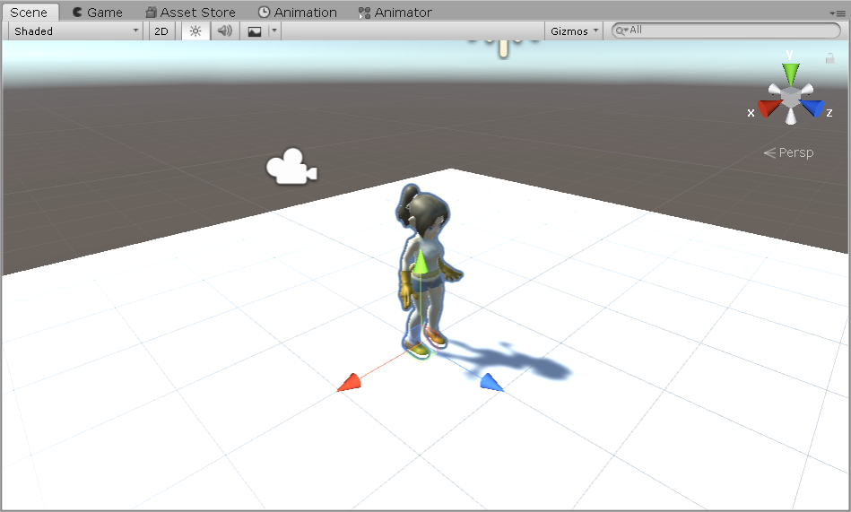
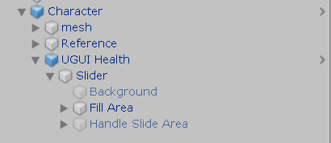
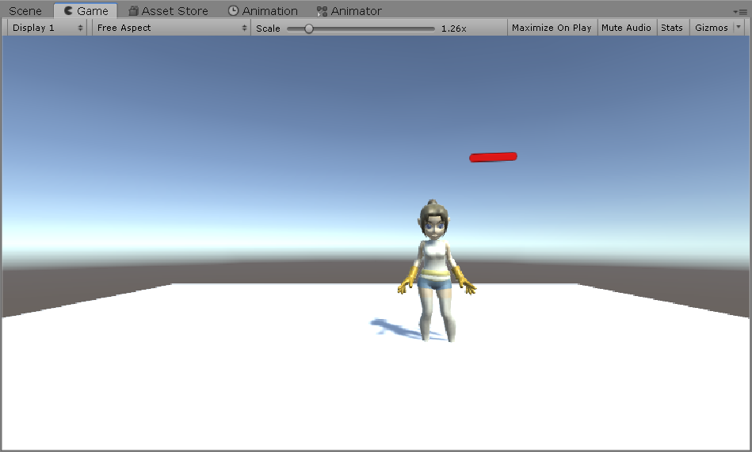
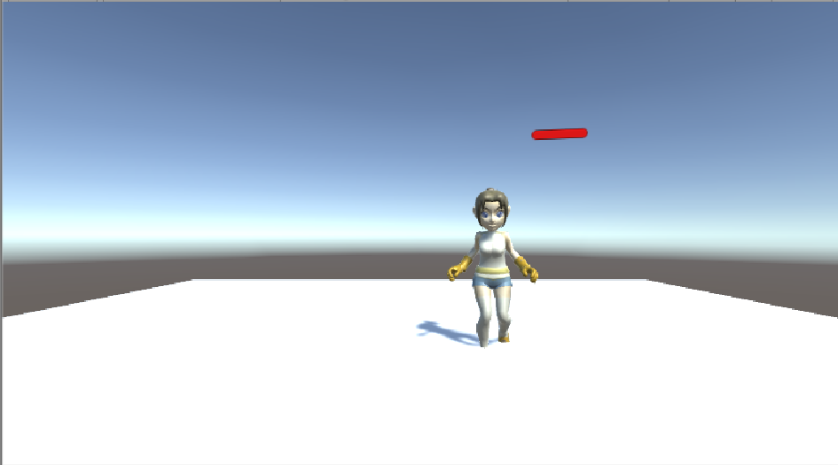
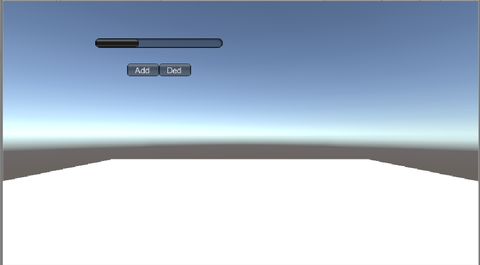

## 第九次作业

本次作业基本要求是五选一，我选择了血条（Health Bar）的预制设计

1、血条（Health Bar）的预制设计。具体要求如下

* 分别使用 IMGUI 和 UGUI 实现
* 使用 UGUI，血条是游戏对象的一个子元素，任何时候需要面对主摄像机
* 分析两种实现的优缺点
* 给出预制的使用方法

### 实现IMGUI 血条
IMGUI用于做不复杂的界面时，更容易操作，基本使用代码实现。

如下给出实现的代码：
```
using System.Collections;
using System.Collections.Generic;
using UnityEngine;

public class IMGUI : MonoBehaviour
{
    public float health = 0.0f;
    private float resultHealth;
    void Start()
    {
        resultHealth = health;
    }

    void OnGUI()
    {
        if (GUI.Button(new Rect(200, 100, 50, 20), "Add"))
        {
            resultHealth = resultHealth + 0.1f > 1.0f ? 1.0f : resultHealth + 0.1f;
        }
        if (GUI.Button(new Rect(250, 100, 50, 20), "Ded"))
        {
            resultHealth = resultHealth - 0.1f < 0.0f ? 0.0f : resultHealth - 0.1f;
        }

        //以0.05f的速度平滑增加health，可以尝试1.0f, 0.1f以及0.01f，比较区别
        health = Mathf.Lerp(health, resultHealth, 0.05f);

        //使用水平滚动条模拟血条，起始位置为0，长度为health
        GUI.HorizontalScrollbar(new Rect(150, 60, 200, 20), 0.0f, health, 0.0f, 1.0f);
    }
}
```

代码实现后，只需将这个脚本加入到某个对象上即可，在这里我是创建一个empty对象进行添加。使用代码实现，血条本身就是面对着屏幕，而如果需要血条随着某个人物移动，这需要另外的脚本实现。

### 实现UGUI 血条
实现UGUI血条，参考课程上的做法。课程上的血条是要添加在人物上，所以我在Asset store下载了一些人物用于测试，并命名为Character。


* 选择 Character 用上下文菜单 -> UI -> Canvas, 添加画布子对象,并命名为UGUI Health

* 选择 Character 的 UGUI Health，用上下文菜单 -> UI -> Slider 添加滑条作为血条子对象
* 运行检查效果
* 选择 Character 的 UGUI Health，在 Inspector 视图
    * 设置 UGUI Health 组件 Render Mode 为 World Space
    * 设置 Rect Transform 组件 (PosX，PosY，Width， Height) 为 (0,2,160,20)
    * 设置 Rect Transform 组件 Scale （x,y） 为 (0.01,0.01)
* 运行检查效果，应该是头顶 Slider 的 Character，用键盘移动 Character，观察


* 展开 Slider
* 选择 Handle Slider Area，禁灰（disable）该元素
    * 选择 Background，禁灰（disable）该元素
    * 选择 Fill Area 的 Fill，修改 Image 组件的 Color 为 红色
    * 选择 Slider 的 Slider 组件
* 设置 MaxValue 为 100
* 设置 Value 为 75
* 运行检查效果，发现血条随人物旋转
给 Canvas 添加以下脚本LookAtCamera.cs 
```
using System.Collections;
using System.Collections.Generic;
using UnityEngine;

public class LookAtCamera : MonoBehaviour
{
    void Update()
    {
        this.transform.LookAt(Camera.main.transform.position);
    }
}
```
最终完成，可是还有个问题，就是如果想要将人物隐藏，那么血条不就暴露了位置。然而这与游戏本身有关，如果某人物只是npc那么，血条自然是要暴露的。而如果是玩家对玩家，这就要加上判断，只能看到自己控制玩家的血条，而不暴露自己的血条给其他玩家。

### 优缺点分析
#### IMGUI
优点： 
* IMGUI的存在符合游戏编程的传统
* 既避免了UI元素保持在屏幕最前端，又有最佳的执行效率
* 经过使用之后，更能体会到，IMGUI就是使用简单的代码控制UI，能够很快速就创建简单的界面

缺点：
* 然而在用户界面上，IMGUI的确是过时了，现在的IMGUI主要用于创建调试界面与定义Unity新的编程工具
* 在实际开发中，IMGUI的确略显拖沓，开发效率低下以及难以调试等
* 实际上，IMGUI的缺点都是因为拥有更具现代特点的UGUI的产生，与之对比，IMGUI的确难以留在主流舞台

#### UGUI
优点：
* 开发更加简易入门，甚至设计师也能参与开发，UGUI就是所见即所得设计工具
* 支持多模式、多摄像机渲染，更符合目前大型游戏的设计需求
* 面向对象的编程

缺点： 
* 缺点暂时不明显，毕竟符合主流，

### 预制使用方法
#### IMGUI
IMGUI的预制是一个带有代码的空对象，只要运行即可。而如果需要将血条应用到游戏对象上，这可能需要一些代码支撑，所以这也是为什么IMGUI的开发效率不如UGUI。

#### UGUI
UGUI血条预制，就是一个画布，其中以及设置好了相对于人物对象的位置。所以需要使用时，只需将其拖出，并添加到某对象作为其子对象即可。

### 结果展示
图片：
 
 
完整视频：[]()